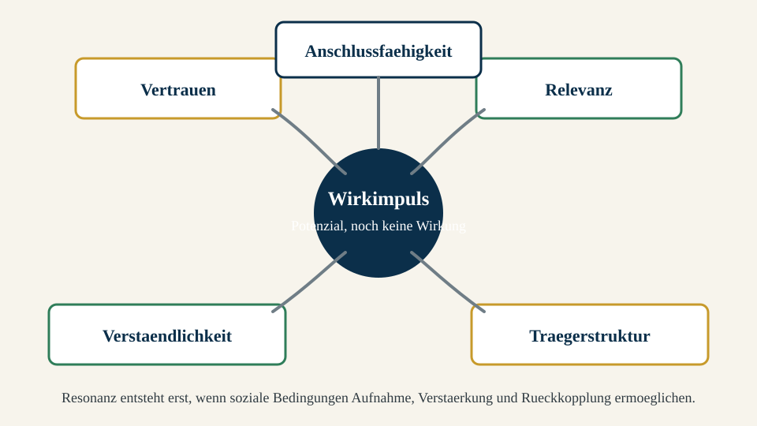

# Grundstudium Wirkungsökonomie · Vorlesung 20: Gesellschaftliche Resonanzfaktoren

**Track:** Grundstudium Wirkungsökonomie  
**Kurscode:** woek-g  
**Vorlesungscode:** V20  
**Titel:** Gesellschaftliche Resonanzfaktoren  
**Voraussetzungen:** V01–V19, insbesondere V18 „Zeit, Generationen und unsichtbare Betroffene" und V19 „Wirkstoff, Wirkmechanismus und Wirkungspotenzial"  
**Lesezeit:** ca. 90–120 Minuten  
**Status:** Studienskript V1 · fachlich finale Codex-Fassung, Claude-CI/CD-Satzfreigabe offen  
**Wissensbasis:** aktuelles Grundlagenwerk, öffentliche WÖk-Referenz, Wirkungsfelder, Werkzeuge, Glossar, Bibliothek, Journal und externe Fachquellen  

## Lernziele

Nach dieser Vorlesung kannst du:

1. erklären, warum Wirkungspotenzial erst unter passenden gesellschaftlichen Resonanzbedingungen in tatsächliche Wirkung übergehen kann.
2. Resonanz von Zustimmung, Reichweite, Aufmerksamkeit und Popularität unterscheiden.
3. fünf zentrale Resonanzfaktoren benennen: Vertrauen, Relevanz, Verständlichkeit, Anschlussfähigkeit und Trägerstruktur.
4. soziale Resonanzräume so beschreiben, dass Wirkung, Wirkungspotenzial und Wirkungsrisiko sauber getrennt bleiben.
5. einfache Resonanzanalysen für politische, mediale, organisatorische oder technologische Wirkimpulse durchführen.
6. rote Linien erkennen: Resonanzarbeit darf Menschen nicht manipulieren, nicht bewerten und nicht zu Social Credit oder moralischer Sortierung werden.

## 1. Einleitung: Die Wirkungsfrage

Warum entfaltet dieselbe Handlung in einer Situation starke Wirkung und in einer anderen fast gar keine? Warum kann eine sachlich richtige Information in einem Umfeld Orientierung stiften und in einem anderen Abwehr auslösen? Warum wird eine gute Innovation manchmal schnell übernommen, während eine ähnlich gute Idee jahrzehntelang liegen bleibt?

Die Antwort liegt häufig nicht im Auslöser allein. Ein Auslöser kann fachlich stark sein, technisch funktionieren und gut gemeint sein. Trotzdem entsteht noch keine tatsächliche Wirkung. Zwischen Wirkungspotenzial und Wirkung liegt ein sozialer Übergang: Der Impuls muss verstanden, aufgenommen, weitergetragen, in Entscheidungen übersetzt und durch Strukturen stabilisiert werden.

Diese Vorlesung nennt diese Bedingungen **gesellschaftliche Resonanzfaktoren**. Resonanz meint hier nicht Applaus, Zustimmung oder Reichweite. Resonanz bedeutet: Ein Wirkimpuls findet in einem sozialen Raum Anschluss und kann dort Zustände verändern. Ein Wirkimpuls kann ein Gesetz, ein Produkt, eine Technologie, eine wissenschaftliche Erkenntnis, eine öffentliche Erzählung, ein pädagogischer Ansatz oder eine organisatorische Entscheidung sein.

Der Kern dieser Vorlesung lautet:

> Wirkungspotenzial wird erst dann zur tatsächlichen Wirkung, wenn ein sozialer Resonanzraum den Wirkimpuls aufnehmen, prüfen, übersetzen und stabilisieren kann.

Das klingt abstrakt, ist aber sehr praktisch. Wer Wirkung steuern will, muss nicht nur fragen, ob eine Idee gut ist. Er muss fragen, unter welchen Bedingungen sie wirksam werden kann.

## 2. Begriffsklärung: Resonanz ist nicht Reichweite

In modernen Öffentlichkeiten werden Reichweite und Wirkung oft verwechselt. Ein Beitrag erreicht viele Menschen, also „wirkt" er angeblich. Eine Kampagne erzielt hohe Klickzahlen, also gilt sie als erfolgreich. Eine politische Botschaft trendet, also scheint sie gesellschaftlich relevant.

Aus Sicht der Wirkungsökonomie ist das zu grob. **Reichweite zählt Kontakte. Wirkung beschreibt tatsächliche Veränderung von Zuständen.** Dazwischen können viele Schritte liegen: Aufmerksamkeit, Verständnis, Einordnung, Vertrauen, Entscheidung, Verhalten, institutionelle Umsetzung und Rückkopplung.

Eine Information über Hitzeschutz kann eine Million Menschen erreichen und trotzdem kaum Schutzwirkung entfalten, wenn sie zu spät kommt, unverständlich ist oder keine lokalen Routinen auslöst. Umgekehrt kann ein kleiner Arbeitskreis in einer Verwaltung große Wirkung entfalten, wenn er eine Beschaffungsregel ändert, die jedes Jahr hunderte Entscheidungen strukturiert.

| Größe | Was sie misst | Was sie nicht beweist | WÖk-Einordnung |
|---|---|---|---|
| Reichweite | erreichte Personen, Kontakte, Views, Verbreitung | Zustandsveränderung, Lernwirkung, Verhaltensänderung | Hilfsgröße, keine Wirkung |
| Aufmerksamkeit | kognitive oder emotionale Hinwendung | Verständnis, Zustimmung, Umsetzung | mögliches Vorfeld von Wirkung |
| Zustimmung | positive Bewertung durch Personen | tatsächliche Veränderung im System | Resonanzhinweis, keine Garantie |
| Resonanz | Anschlussfähigkeit eines Impulses im sozialen Raum | automatisch positive Wirkung | Übergang zwischen Potenzial und Wirkung |
| Wirkung | tatsächliche Veränderung von Zuständen | moralische Bewertung allein | Kernbegriff der WÖk |

Diese Unterscheidung schützt vor zwei Fehlern. Der erste Fehler ist der mediale Fehlschluss: Was laut ist, gilt als wirksam. Der zweite Fehler ist der technokratische Fehlschluss: Was sachlich richtig ist, werde sich schon durchsetzen. Beide unterschätzen soziale Resonanzbedingungen.

## 3. Die fünf zentralen Resonanzfaktoren

Für eine erste Analyse reichen fünf Faktoren. Sie sind keine starre Checkliste, sondern ein Orientierungsmodell.

*Abbildung 1: Ein Wirkimpuls wird erst durch Resonanzfaktoren sozial anschlussfähig. Alt-Text: Ein Diagramm zeigt einen Wirkimpuls in der Mitte und fünf umgebende Resonanzfaktoren: Vertrauen, Relevanz, Verständlichkeit, Anschlussfähigkeit und Trägerstruktur.*

### 3.1 Vertrauen

Vertrauen ist der vielleicht stärkste Resonanzfaktor. Es bedeutet nicht blinde Zustimmung. Vertrauen bedeutet, dass Quelle, Verfahren und Absicht hinreichend verlässlich erscheinen, damit Menschen einen Impuls überhaupt prüfen.

Ohne Vertrauen kann sogar gute Evidenz wirkungslos bleiben. Eine Behörde kann korrekte Hitzewarnungen veröffentlichen, aber wenn sie als fern, unverständlich oder interessengeleitet wahrgenommen wird, kommen die Warnungen nicht in Routinen an. Ein Unternehmen kann Nachhaltigkeitsdaten berichten, aber wenn die Öffentlichkeit Impact-Washing vermutet, entsteht eher Misstrauen als Lernwirkung.

Für die WÖk ist Vertrauen keine weiche Nebensache. Es ist eine Wirkungsbedingung. Wer Vertrauen beschädigt, beschädigt oft künftige Wirkungspotenziale mit. Deshalb sind Transparenz, Quellenklarheit, Fehlerkultur und nachvollziehbare Verfahren so wichtig.

### 3.2 Relevanz

Relevanz beantwortet die Frage: Warum betrifft mich das? Ein Thema kann global bedeutsam und lokal unsichtbar sein. Es kann wissenschaftlich dringend und alltagsfern wirken. Resonanz entsteht leichter, wenn Menschen erkennen, wie ein Wirkimpuls ihre Sicherheit, Gesundheit, Handlungsmöglichkeiten, Kosten, Zukunft oder demokratische Teilhabe berührt.

Relevanz ist relational. Eine Hitzeschutzstrategie ist für Pflegeeinrichtungen akut, für junge gesunde Menschen vielleicht abstrakter. Ein Lieferkettenthema ist für ein Beschaffungsteam operativ relevant, für Endkundinnen zunächst unsichtbar. Eine gute Resonanzanalyse fragt deshalb nicht: Ist das Thema objektiv wichtig? Sie fragt zusätzlich: Für wen wird es unter welchen Bedingungen erkennbar wichtig?

### 3.3 Verständlichkeit

Verständlichkeit heißt nicht Vereinfachung bis zur Unwahrheit. Sie heißt: Der innere Zusammenhang wird zugänglich. Menschen müssen erkennen können, was der Auslöser ist, welcher Wirkpfad gemeint ist, welche Zustände betroffen sind und welche Unsicherheiten bleiben.

Gerade die Wirkungsökonomie braucht diese Sorgfalt. Sie verwendet präzise Begriffe: Wirkung, Wirkungspotenzial, Wirkungsrisiko, Netto-Wirkung, Transformationswirkung, Wirkungslenkung und Wirkungsarchitektur. Wenn diese Begriffe vermischt werden, sinkt Verständlichkeit und damit Resonanz. Gute Wirkungssprache ist klar, aber nicht flach.

### 3.4 Anschlussfähigkeit

Anschlussfähigkeit beschreibt, ob ein neuer Impuls an vorhandene Erfahrungen, Institutionen, Rollen, Begriffe und Routinen anknüpfen kann. Ein Konzept kann inhaltlich richtig sein und trotzdem scheitern, wenn es keine Brücke zur vorhandenen Praxis hat.

Anschlussfähigkeit ist keine Anpassung um jeden Preis. Die WÖk darf nicht so weichgespült werden, dass ihre Schutzlogik verschwindet. Nichtkompensation, Reverse Merit Order und die Unterscheidung von Wirkung und Reichweite sind nicht verhandelbare Präzisionen. Aber diese Präzisionen müssen so übersetzt werden, dass Verwaltungen, Unternehmen, Schulen, Medien, Kommunen oder Bürgerinnen sie in ihrer eigenen Handlungssprache wiederfinden können.

### 3.5 Trägerstruktur

Wirkung bleibt oft instabil, wenn sie nur individuelle Einsicht erzeugt. Dauerhafte Wirkung braucht Trägerstrukturen: Routinen, Zuständigkeiten, Budgets, Standards, Lernschleifen, Rechtsrahmen, Bildungsformate, technische Systeme oder professionelle Rollen.

Ein Beispiel: Viele Menschen können verstehen, dass Hitzeschutz wichtig ist. Tatsächliche Wirkung entsteht aber erst, wenn Pflegeheime Trinkpläne anpassen, Schulen Schattenkonzepte haben, Kommunen kühle Orte ausweisen und Nachbarschaften Warnketten kennen. Dann wird Einsicht in Struktur übersetzt.

## 4. Ein heuristisches Modell

Resonanz lässt sich nicht vollständig in eine Formel pressen. Trotzdem kann eine einfache Heuristik helfen:

$$
RP = f(V, R, K, A, T)
$$

Dabei steht:

- $$RP$$ für Resonanzpotenzial,
- $$V$$ für Vertrauen,
- $$R$$ für Relevanz,
- $$K$$ für Klarheit beziehungsweise Verständlichkeit,
- $$A$$ für Anschlussfähigkeit,
- $$T$$ für Trägerstruktur.

Diese Formel ist keine Messformel im engen Sinn. Sie ist eine Denkformel. Sie erinnert daran, dass Resonanz nicht aus einem Faktor entsteht. Ein Impuls mit hoher Relevanz kann scheitern, wenn Vertrauen fehlt. Ein verständlicher Impuls kann folgenlos bleiben, wenn keine Trägerstruktur existiert. Eine starke Trägerstruktur kann wirkungsarm bleiben, wenn sie keinen relevanten Zustand adressiert.

Für einfache Analysen kann man jeden Faktor qualitativ einschätzen:

| Faktor | Leitfrage | Niedrige Ausprägung | Hohe Ausprägung |
|---|---|---|---|
| Vertrauen | Gilt Quelle/Verfahren als verlässlich? | Verdacht, Intransparenz, Fehlerabwehr | Quellenklarheit, Fehlerkultur, Prüfbarkeit |
| Relevanz | Wird die Betroffenheit erkennbar? | abstrakt, fern, folgenlos | alltagsnah, sicherheitsrelevant, entscheidungsnah |
| Verständlichkeit | Wird der Wirkpfad verstanden? | Fachsprache, Vermischung von Begriffen | klare Begriffe, Beispiele, Grenzen |
| Anschlussfähigkeit | Passt der Impuls an vorhandene Praxis? | Fremdlogik, Rollenbruch, Überforderung | Brücken zu Routinen und Institutionen |
| Trägerstruktur | Gibt es Umsetzungsträger? | keine Zuständigkeit, kein Budget | Rollen, Prozesse, Monitoring |

## 5. Resonanz und Wirkungsrisiko

Resonanz ist nicht automatisch gut. Ein schädlicher Impuls kann ebenfalls Resonanz finden. Desinformation, Angstkommunikation oder autoritäre Vereinfachungen können starke Resonanz erzeugen, wenn sie an Unsicherheit, Statusverlust oder Misstrauen anschließen. Deshalb darf die WÖk Resonanz nie mit positiver Wirkung verwechseln.

Hier ist die Unterscheidung aus den vorherigen Vorlesungen entscheidend:

- Ein Impuls kann **Wirkungspotenzial** haben, ohne schon Wirkung zu entfalten.
- Ein Impuls kann **Resonanz** erzeugen, ohne positive Netto-Wirkung zu erzeugen.
- Ein Impuls kann **negative Wirkung** entfalten, wenn Resonanzräume Angst, Polarisierung oder Fehlanreize verstärken.

Die demokratische Leitplanke ist klar: Resonanzarbeit soll Klärung ermöglichen, nicht Menschen manipulieren. Die WÖk ist keine Sprachpolizei, kein Social-Credit-System und keine Methode zur Bewertung einzelner Personen. Sie bewertet Wirkpfade, Strukturen und Zustandsveränderungen, nicht den moralischen Wert von Menschen.

## 6. Fallstudie: Kommunaler Hitzeschutz

Eine Kommune entwickelt einen Hitzeschutzplan. Fachlich ist das Thema gut begründet. Klimawandel erhöht die Zahl heißer Tage, ältere Menschen und chronisch Kranke sind besonders gefährdet, Schulen und Pflegeeinrichtungen brauchen Routinen. Trotzdem ist die Wirkung nicht automatisch da.

### 6.1 Der Wirkimpuls

Der Wirkimpuls ist ein kommunaler Hitzeschutzplan mit Warnsystem, kühlen Orten, Informationsmaterial, Pflegeprotokollen und Anpassungen bei Veranstaltungen.

### 6.2 Resonanzanalyse

| Resonanzfaktor | Hitzeschutz-Frage | Mögliche Schwäche | Verbessernde Maßnahme |
|---|---|---|---|
| Vertrauen | Wer spricht die Warnung aus? | Warnungen gelten als übertrieben | gemeinsame Kommunikation von Kommune, Ärztinnen, Pflege und Schulen |
| Relevanz | Wer erkennt eigene Betroffenheit? | Hitze gilt als Komfortproblem | Fokus auf Gesundheit, Schlaf, Medikamente, Arbeitsschutz |
| Verständlichkeit | Sind Handlungen klar? | abstrakte Klimasprache | konkrete Routinen: trinken, Schatten, Check-in, Zeiten |
| Anschlussfähigkeit | Wo dockt es an? | keine Verbindung zu Pflege- und Schulalltag | Protokolle in bestehende Dienstpläne einbauen |
| Trägerstruktur | Wer setzt um? | niemand verantwortlich | Hitzeschutzbeauftragte, Notfallketten, Monitoring |

### 6.3 Von Potenzial zu Wirkung

Das Wirkungspotenzial liegt in weniger hitzebedingten Erkrankungen, geringerer Belastung von Rettungsdiensten, mehr Sicherheit für vulnerable Gruppen und höherer kommunaler Resilienz. Tatsächliche Wirkung entsteht erst, wenn sich Zustände verändern: weniger Notfälle, bessere Versorgung, veränderte Routinen, stabile Warnketten.

Ein Wirkungsbericht müsste deshalb nicht nur zählen, wie viele Flyer verteilt wurden. Er müsste fragen: Haben Pflegeeinrichtungen ihre Routinen angepasst? Wurden kühle Orte genutzt? Erreichten Warnungen Menschen ohne digitale Zugänge? Gab es Rückkopplung nach Hitzetagen? Genau hier wird Reporting von Rückkopplung unterschieden.

## 7. Praxiswerkzeug: Resonanz-Mini-Check

Für jedes Projekt, jede Kampagne oder jede Regeländerung kann ein kurzer Resonanz-Mini-Check helfen.

1. **Wirkimpuls benennen:** Was ist der Auslöser?
2. **Wirkungsempfänger benennen:** Bei wem soll sich ein Zustand verändern?
3. **Wirkungspotenzial trennen:** Welche positive Veränderung ist möglich, aber noch nicht belegt?
4. **Resonanzfaktoren prüfen:** Wo sind Vertrauen, Relevanz, Verständlichkeit, Anschlussfähigkeit und Trägerstruktur stark oder schwach?
5. **Wirkungsrisiken prüfen:** Welche Resonanz könnte negative Effekte verstärken?
6. **Rückkopplung planen:** Woran erkennen wir, ob sich ein Zustand tatsächlich verändert?

Dieser Mini-Check ersetzt keine vollständige Wirkungsanalyse. Er verhindert aber, dass gute Ideen an sozialen Bedingungen vorbeigeplant werden.

## 8. Vertiefung: Resonanz als Übergang zwischen Potenzial und Wirkung

Die bisherigen Vorlesungen haben Wirkung als tatsächliche Zustandsveränderung beschrieben. Diese Definition ist
absichtlich streng. Sie schützt davor, alles schon Wirkung zu nennen, was gut gemeint, laut kommuniziert, häufig
geklickt oder politisch gewünscht ist. In dieser Vorlesung kommt nun ein Zwischenbegriff hinzu: **Resonanz**. Er
erklärt, warum zwischen einer Möglichkeit und einer eingetretenen Veränderung oft ein sozialer, institutioneller und
kultureller Übergang liegt.

In der WÖk ist Resonanz kein romantischer Begriff. Es geht nicht darum, ob etwas „ankommt" im Sinne von Sympathie.
Es geht darum, ob ein Wirkimpuls in einem Wirkungsraum so aufgenommen, verstanden, geprüft, übersetzt und getragen
wird, dass er Zustände verändern kann. Resonanz ist damit eine Bedingung von Wirkung, aber nicht selbst schon die
Wirkung. Diese Unterscheidung ist wichtig, weil gerade moderne Öffentlichkeiten Resonanz gerne mit Wirkung
verwechseln. Ein Thema erzeugt Aufregung, also scheint es wirksam. Eine Botschaft verbreitet sich, also scheint sie
bedeutsam. Eine Empörung dominiert für zwei Tage die Plattformen, also scheint sie gesellschaftlich relevant. Aus
wirkungsökonomischer Sicht ist das höchstens ein Anfang der Analyse.

Ein Wirkimpuls kann hohe Resonanz erzeugen und trotzdem keine positive Wirkung entfalten. Er kann sogar negative
Wirkung entfalten, wenn Resonanz Angst, Polarisierung, Misstrauen, falsche Prioritäten oder institutionelle
Blockaden verstärkt. Umgekehrt kann ein Wirkimpuls zunächst geringe öffentliche Resonanz haben und dennoch später
starke positive Wirkung erzeugen, wenn er in Trägerstrukturen übersetzt wird. Viele Sicherheitsstandards,
Gesundheitsroutinen, Bildungsreformen, Produktnormen oder Verwaltungsverfahren wirken nicht, weil sie täglich
Applaus bekommen, sondern weil sie in Entscheidungen eingebaut wurden.

Damit entsteht eine sehr praktische Unterscheidung:

| Ebene | Leitfrage | Typischer Nachweis | Risiko der Verwechslung |
|---|---|---|---|
| Wirkungspotenzial | Was könnte sich verändern? | plausible Theorie, Evidenz, Vergleichsfälle | Möglichkeit als Ergebnis ausgeben |
| Resonanz | Wird der Impuls aufgenommen und übersetzt? | Vertrauen, Anschluss, Diskussion, Routinen, Träger | Aufmerksamkeit als Wirkung ausgeben |
| Wirkung | Was hat sich tatsächlich verändert? | Zustandsdaten, qualitative Evidenz, Rückkopplung | Output als Zustandsveränderung ausgeben |
| Bewertung | Ist die Veränderung positiv, negativ oder ambivalent? | Referenzrahmen SDGs, Agenda 2030, SDG+, WÖk-Schutzlinien | einzelne Vorteile mit Gesamtnutzen verwechseln |

Diese Tabelle ist kein bürokratisches Schema. Sie ist ein Schutz vor Übertreibung. Wer Wirkung behauptet, obwohl nur
Resonanz beobachtet wurde, erzeugt Scheinwissen. Wer Resonanz ignoriert, obwohl Wirkungspotenzial vorhanden ist,
plant an der sozialen Wirklichkeit vorbei. Wer Bewertung ohne Wirkung vornimmt, moralisiert. Wer Wirkung ohne
Bewertung beschreibt, bleibt blind für Richtung und Nebenwirkungen.

## 9. Anschluss an bekannte sozialwissenschaftliche Modelle

Die WÖk muss Resonanz nicht aus dem Nichts erfinden. Sie kann an mehrere wissenschaftliche Traditionen anschließen,
ohne sich mit einer einzelnen Theorie zu verwechseln.

### 9.1 Diffusion: Warum sich Neues nicht automatisch verbreitet

Everett Rogers hat mit der Diffusionsforschung gezeigt, dass Innovationen nicht einfach deshalb übernommen werden,
weil sie technisch besser sind. Entscheidend sind unter anderem wahrgenommener Nutzen, Kompatibilität mit bestehenden
Praktiken, Komplexität, Erprobbarkeit und Beobachtbarkeit. Für die WÖk ist daran besonders wichtig: Ein Wirkimpuls
muss an bestehende Handlungslogiken anschließen. Ein neues Produkt, eine neue Regel oder ein neues Verfahren wird
nicht nur nach objektiver Qualität aufgenommen, sondern nach wahrgenommener Passung.

Das bedeutet nicht, dass die WÖk sich nach Bequemlichkeit richten soll. Manche Wirkungslogiken müssen Zumutungen
benennen: Nichtkompensation, harte rote Linien, Schutz vor Greenwashing, Schutz künftiger Generationen oder
Rückkopplungspflichten. Aber auch Zumutungen brauchen Übersetzungsarbeit. Eine Kommune versteht eine andere Sprache
als ein Finanzinstitut, eine Schule eine andere als ein Lieferant, ein Pflegeheim eine andere als ein
Produktentwicklungsteam. Anschlussfähigkeit bedeutet, diese Sprachen zu kennen, ohne den Maßstab zu verwässern.

### 9.2 Agenda-Setting: Warum manche Themen in Entscheidungen kommen

John Kingdon beschreibt politische Aufmerksamkeit als Zusammenspiel von Problemen, Lösungen und Gelegenheitsfenstern.
Ein Problem muss als Problem erkannt werden, eine Lösung muss verfügbar erscheinen, und ein politischer Moment muss
Handlung möglich machen. Für die WÖk ist diese Perspektive nützlich, weil viele Wirkungsfragen nicht an fehlender
Erkenntnis scheitern, sondern an fehlender Entscheidungsfähigkeit.

Klimarisiken, Pflegenotstand, Desinformation, Bildungsungleichheit oder Wohnkosten sind selten völlig unbekannt.
Trotzdem werden sie oft spät bearbeitet. Resonanzanalyse fragt deshalb: Ist das Problem sichtbar? Gibt es
verständliche Handlungsoptionen? Gibt es Zuständigkeiten? Gibt es eine Gelegenheit, in der Entscheidungsträgerinnen
das Thema aufnehmen können? Ohne diese Fragen bleibt Wirkungspolitik leicht bei Appellen stehen.

### 9.3 Vertrauen: Warum Verfahren wichtiger sind als Behauptungen

Niklas Luhmann beschreibt Vertrauen als Mechanismus zur Reduktion sozialer Komplexität. Menschen können nicht jede
Information vollständig selbst prüfen. Sie verlassen sich auf Quellen, Verfahren, Rollen, Institutionen und
Erfahrungen. Für die WÖk ist Vertrauen deshalb keine Gefühlsfrage am Rand, sondern eine infrastrukturelle Bedingung
von Wirkung.

Wenn Institutionen Daten veröffentlichen, aber Fehler nicht korrigieren, sinkt Vertrauen. Wenn Unternehmen
Nachhaltigkeit behaupten, aber Lieferkettenrisiken verschleiern, sinkt Vertrauen. Wenn Medien Zuspitzung mit
Einordnung verwechseln, sinkt Vertrauen. Und wenn Politik Wirkung verspricht, aber nur Output berichtet, sinkt
Vertrauen ebenfalls. Vertrauen entsteht nicht durch die Behauptung, vertrauenswürdig zu sein. Es entsteht durch
prüfbare Verfahren, Quellenklarheit, Fehlertoleranz, Korrektur und konsistente Begriffe.

### 9.4 Framing und Öffentlichkeit: Warum dieselbe Tatsache unterschiedlich wirkt

Framing-Forschung zeigt, dass Informationen immer in Deutungsrahmen auftreten. Ein Hitzeschutzplan kann als
Gesundheitsschutz, Bürokratie, Klimaanpassung, Freiheitsbeschränkung, kommunale Fürsorge oder Kostenproblem
gerahmt werden. Die Fakten ändern sich dadurch nicht vollständig, aber ihre Wahrnehmung, Anschlussfähigkeit und
Handlungswahrscheinlichkeit verändern sich.

Die WÖk muss hier sehr präzise sein: Framing ist nicht automatisch Manipulation. Jede Erklärung setzt Akzente.
Manipulativ wird Kommunikation, wenn sie relevante Wirkungen verschweigt, Unsicherheit verdeckt, Gegner entmenschlicht,
Angst absichtlich übersteuert oder Menschen in eine gewünschte Reaktion drückt. Gute Wirkungssprache dagegen macht
Wirkpfade sichtbar, nennt Quellen, zeigt Unsicherheit, trennt Wirkungspotenzial von Wirkung und ermöglicht eigene
Prüfung. Das ist der Unterschied zwischen Resonanzarbeit und Überwältigung.

## 10. Die fünf Resonanzfaktoren als Analyseinstrument

Die fünf Faktoren Vertrauen, Relevanz, Verständlichkeit, Anschlussfähigkeit und Trägerstruktur lassen sich als
Analysewerkzeug nutzen. Sie sind nicht vollständig, aber robust genug für erste Diagnosen.

### 10.1 Vertrauen als Quellen- und Verfahrensfrage

Vertrauen hat mindestens vier Ebenen:

1. **Quellenvertrauen:** Wer spricht, und warum sollte die Quelle verlässlich sein?
2. **Verfahrensvertrauen:** Wie wurden Daten, Einschätzungen oder Empfehlungen gewonnen?
3. **Absichtsvertrauen:** Welche Interessen sind sichtbar, welche bleiben verdeckt?
4. **Korrekturvertrauen:** Was passiert, wenn eine Aussage falsch, unvollständig oder überholt ist?

Für die WÖk ist besonders die vierte Ebene wichtig. Eine lernende Wirkungsökonomie kann Fehler nicht vermeiden, aber
sie muss Fehler sichtbar und korrigierbar machen. Ein System, das nur perfekte Sicherheit behauptet, verliert
Vertrauen, sobald Unsicherheit sichtbar wird. Ein System, das Unsicherheit offenlegt und Rückkopplung organisiert,
kann Vertrauen sogar durch Korrektur stärken.

### 10.2 Relevanz als Betroffenheitsbrücke

Relevanz entsteht, wenn Menschen oder Institutionen erkennen, dass ein Thema einen Zustand berührt, der für sie
wichtig ist. Das kann körperliche Sicherheit sein, Gesundheit, Kosten, Würde, Zeit, Autonomie, demokratische
Mitsprache, Zukunftschancen oder ökologische Lebensgrundlagen.

Wirkungsökonomisch ist Relevanz nicht beliebig subjektiv. Nicht alles, was jemand als relevant empfindet, ist
deshalb positive Wirkung. Aber ohne erkennbare Betroffenheit bleibt ein Wirkimpuls oft abstrakt. Gerade globale
Risiken brauchen Übersetzung in lokale und konkrete Wirkungsräume. Klimaanpassung wird greifbarer, wenn sie als
Hitzeschutz im Pflegeheim erscheint. Datenqualität wird greifbarer, wenn sie entscheidet, ob eine Investition
wirklich Risiken senkt. Demokratie wird greifbarer, wenn Menschen erleben, dass Fakten, Verfahren und Korrektur
ihren Alltag schützen.

### 10.3 Verständlichkeit als begriffliche Verantwortung

Verständlichkeit ist nicht Vereinfachung um jeden Preis. Ein Begriff darf anspruchsvoll sein, wenn er etwas
präzisiert, das sonst verschwimmt. Die WÖk braucht präzise Begriffe, weil sie sonst selbst zum unscharfen
Versprechen würde. Wirkung, Wirkungspotenzial, Wirkungsrisiko, Nebenwirkung, Netto-Wirkung,
Transformationswirkung, Wirkungslenkung und Wirkungsarchitektur dürfen nicht ineinanderfallen.

Gute Verständlichkeit hat drei Ebenen:

- **sprachliche Klarheit:** kurze, eindeutige Sätze ohne unnötige Fachschwere.
- **modellhafte Klarheit:** sichtbare Wirkpfade, Tabellen, Beispiele, Falllogiken.
- **normative Klarheit:** transparente Unterscheidung zwischen Beschreibung und Bewertung.

Wenn diese Ebenen fehlen, entsteht Scheingenauigkeit. Dann klingen Begriffe wissenschaftlich, ohne Entscheidungen
zu verbessern. Die WÖk muss deshalb wissenschaftlich anschlussfähig und zugleich alltagstauglich bleiben.

### 10.4 Anschlussfähigkeit als Brücke zur Praxis

Anschlussfähigkeit fragt: Wo kann der Impuls andocken? In einer Organisation kann das ein Prozess, ein Budget, eine
Kennzahl, eine Führungsroutine oder ein Risikomanagementsystem sein. In einer Kommune kann es ein Haushaltsverfahren,
eine Beschaffungsrichtlinie, ein Beteiligungsformat oder ein Klimaanpassungsplan sein. In Medien kann es ein
Redaktionsstandard, eine Quellenprüfung, eine Korrekturpraxis oder eine Plattformregel sein.

Anschlussfähigkeit ist besonders wichtig, weil viele gute Ideen an falscher Flughöhe scheitern. Sie bleiben zu
abstrakt für operative Rollen und zu operativ für strategische Entscheidungen. Eine resonanzfähige WÖk-Übersetzung
zeigt deshalb immer mindestens zwei Ebenen: die große Logik und den nächsten konkreten Andockpunkt.

### 10.5 Trägerstruktur als Stabilisierung von Wirkung

Trägerstrukturen übersetzen Einsicht in Dauer. Ohne sie bleibt Wirkung abhängig von einzelnen Personen, Kampagnen
oder Stimmungen. Trägerstrukturen können institutionell, rechtlich, technisch, finanziell, kulturell oder
professionell sein.

Beispiele:

| Wirkimpuls | schwache Trägerstruktur | starke Trägerstruktur |
|---|---|---|
| Hitzeschutz | einmalige Informationskampagne | kommunaler Plan, Pflegeprotokolle, Warnketten, kühle Orte, Monitoring |
| Medienqualität | Appell an Verantwortung | Redaktionsstandards, Quellenlog, Korrekturroutine, Plattformtransparenz |
| nachhaltige Beschaffung | freiwilliger Hinweis | Vergabekriterien, Datenpflicht, Schulung, Audit, Rückkopplung |
| Wirkungskompetenz in Schulen | Projektwoche | Curriculum, Lehrkräftefortbildung, Aufgabenformate, Schulentwicklung |
| Produktwirkung | Labelversprechen | digitale Produktpässe, WÖk-IDs, Scorecards, Beschaffungswirkung |

Trägerstrukturen sind kein Ersatz für Wirkung. Sie sind Bedingungen, unter denen Wirkung wahrscheinlicher und
prüfbarer wird. Auch eine starke Struktur kann falsch wirken, wenn sie schlechte Ziele stabilisiert. Deshalb müssen
Trägerstrukturen selbst rückkopplungsfähig bleiben.

## 11. Resonanzdiagnose: Ein Arbeitsverfahren in sieben Schritten

Für die Praxis reicht es nicht, die fünf Faktoren zu kennen. Man muss sie anwenden können. Die folgende Diagnose ist
für Projekte, Kommunikation, politische Programme, Produkte, interne Organisationsentscheidungen und Bildungsformate
geeignet.

### Schritt 1: Wirkimpuls und behauptetes Potenzial trennen

Zunächst wird der Wirkimpuls benannt. Das kann eine Maßnahme, ein Produkt, eine Regel, eine Aussage, ein Tool, ein
Preis, eine Förderung oder ein institutionelles Verfahren sein. Danach wird das behauptete Wirkungspotenzial
notiert. Wichtig ist die Trennung: Der Auslöser ist nicht die Wirkung. Das Potenzial ist nicht der Nachweis.

### Schritt 2: Wirkungsempfänger bestimmen

Wer ist direkt betroffen? Wer indirekt? Wer hat keine Stimme im Verfahren, ist aber betroffen? Künftige Generationen,
Ökosysteme, Kinder, pflegebedürftige Menschen, nicht organisierte Verbraucherinnen oder lokale Gemeinschaften werden
oft zu spät einbezogen. Resonanzanalyse darf deshalb nicht nur fragen, wer laut reagiert. Sie muss auch fragen, wer
nicht reagieren kann.

### Schritt 3: Resonanzraum beschreiben

Ein Resonanzraum ist der soziale, institutionelle oder kommunikative Raum, in dem ein Impuls aufgenommen wird. Das
kann ein Markt, eine Schule, eine Verwaltung, eine Plattformöffentlichkeit, ein kommunaler Beteiligungsprozess, ein
Team, eine Branche oder eine Lieferkette sein. Jeder Resonanzraum hat eigene Regeln: Sprache, Macht, Vertrauen,
Routinen, Konflikte, Zeitdruck und Datenlage.

### Schritt 4: Fünf Faktoren bewerten

Die fünf Resonanzfaktoren werden nicht als Score absolut gemessen, sondern zunächst qualitativ eingeschätzt. Eine
einfache Ampel reicht für die erste Diagnose:

| Faktor | Grün | Gelb | Rot |
|---|---|---|---|
| Vertrauen | Quelle und Verfahren sind nachvollziehbar | einzelne Zweifel oder fehlende Korrekturroutine | Misstrauen, verdeckte Interessen, frühere Täuschung |
| Relevanz | Betroffenheit ist konkret erkennbar | Relevanz muss noch übersetzt werden | Thema wirkt fern oder folgenlos |
| Verständlichkeit | Wirkpfad und Begriffe sind klar | Fachsprache oder Unschärfen bleiben | zentrale Begriffe werden vermischt |
| Anschlussfähigkeit | konkrete Andockpunkte existieren | Andockpunkte sind möglich, aber ungeklärt | keine Rolle, kein Prozess, keine institutionelle Passung |
| Trägerstruktur | Zuständigkeit, Ressourcen und Lernschleifen vorhanden | teilweise vorhanden | keine dauerhafte Struktur |

### Schritt 5: Wirkungsrisiken prüfen

Resonanz kann Schäden verstärken. Eine Kommunikation kann Aufmerksamkeit erzeugen und gleichzeitig Polarisierung
erhöhen. Eine Technologie kann Akzeptanz finden und zugleich Abhängigkeiten vertiefen. Eine Regel kann Vertrauen
in einer Gruppe erhöhen und eine andere ausschließen. Deshalb gehört zu jeder Resonanzdiagnose eine Risikospalte:
Welche negative Zustandsveränderung könnte durch denselben Resonanzpfad entstehen?

### Schritt 6: Rückkopplung festlegen

Ohne Rückkopplung bleibt Resonanzdiagnose eine Momentaufnahme. Rückkopplung bedeutet: Es wird festgelegt, welche
Beobachtung später entscheidet, ob der Impuls angepasst, verstärkt, beendet oder anders übersetzt wird. Das kann
ein quantitativer Indikator sein, aber auch qualitative Evidenz: Beschwerden, Interviews, Nutzungsdaten,
Beobachtungen in Einrichtungen, Fallanalysen oder Auditbefunde.

### Schritt 7: Entscheidung ableiten

Am Ende steht keine moralische Gesamtwertung von Menschen, sondern eine Entscheidung über den Wirkimpuls:
weiterführen, anders kommunizieren, anders strukturieren, begrenzen, testen, stoppen oder in einen anderen
Resonanzraum übersetzen. Genau hier wird Resonanzanalyse zur Wirkungslenkung.

## 12. Fallstudie 2: Öffentliche Kommunikation über Fakten

Viele demokratische Konflikte zeigen, dass Fakten allein nicht automatisch wirken. Das bedeutet nicht, dass Wahrheit
unwichtig wäre. Im Gegenteil: Ohne belastbare Fakten verliert öffentliche Steuerung ihre Grundlage. Aber Fakten
entfalten Wirkung nur, wenn sie in einem Resonanzraum verstanden, geprüft und handlungsrelevant werden.

Nehmen wir eine Kampagne gegen Desinformation. Sie veröffentlicht korrekte Faktenchecks, zeigt Quellen und
widerlegt falsche Behauptungen. Das Wirkungspotenzial ist hoch: Bürgerinnen könnten besser informiert entscheiden,
Manipulation könnte sinken, Vertrauen in demokratische Verfahren könnte steigen. Trotzdem kann die Kampagne
scheitern, wenn die Resonanzbedingungen ungünstig sind.

| Resonanzfaktor | mögliche Stärke | mögliche Schwäche |
|---|---|---|
| Vertrauen | unabhängige Quellen, transparente Methode | Faktencheck wird als parteiisch wahrgenommen |
| Relevanz | Bezug zu Alltag, Wahlentscheidung, Sicherheit | Thema wirkt abstrakt oder belehrend |
| Verständlichkeit | klare Darstellung von Behauptung, Quelle, Wirkpfad | zu technische Sprache, zu viele Details |
| Anschlussfähigkeit | Einbettung in Schulen, Medien, Plattformregeln | isolierte Website ohne soziale Träger |
| Trägerstruktur | Redaktionen, Bildungsformate, Korrekturroutinen | einmalige Kampagne ohne Fortsetzung |

Die WÖk-Pointe lautet: Ein Faktencheck ist ein Auslöser mit Wirkungspotenzial. Wirkung entsteht erst, wenn sich
Zustände verändern: Menschen erkennen manipulative Muster, Medien korrigieren schneller, Plattformen begrenzen
Verstärkungslogiken, Bildungsformate stärken Urteilskraft, demokratische Diskussion bleibt korrigierbar. Reichweite
des Faktenchecks ist dafür höchstens ein Hinweis, kein Nachweis.

Diese Fallstudie zeigt auch die rote Linie. Eine demokratische Resonanzstrategie darf Menschen nicht manipulieren,
beschämen oder sortieren. Sie soll Räume schaffen, in denen Prüfung möglich wird. Das ist anspruchsvoller als
Gegenpropaganda. Es braucht Geduld, Fehlerkultur, verständliche Sprache und Institutionen, die Korrektur nicht als
Gesichtsverlust behandeln.

## 13. Fallstudie 3: Produktwirkung und Verbraucherinformation

Ein Produkt kann ein hoher Resonanzträger sein, weil Menschen es sehen, kaufen, nutzen und vergleichen. Darin liegt
eine Chance für die Wirkungsökonomie. Produktinformationen können Wirkung alltagsnah machen. Gleichzeitig sind
Produkte anfällig für Vereinfachung: Ein Label, ein Score oder ein grünes Versprechen kann den Eindruck erwecken,
die Wirkung sei vollständig geklärt.

Nehmen wir ein Lebensmittelprodukt. Die Wirkung kann Boden, Wasser, Klima, Biodiversität, Arbeitsbedingungen,
Gesundheit, Verpackung, Transport, regionale Wertschöpfung und Abfall betreffen. Verbraucherinnen können nicht all
diese Wirkpfade selbst prüfen. Sie brauchen verständliche, vertrauenswürdige und anschlussfähige Information.

Resonanz entsteht hier, wenn drei Bedingungen zusammenkommen:

1. Die Information ist **verständlich** genug, um in Kaufentscheidungen einzufließen.
2. Die Datenbasis ist **vertrauenswürdig** genug, um nicht als Labelmarketing abgetan zu werden.
3. Die Struktur ist **tragfähig** genug, um Unternehmen, Handel, Beschaffung und Politik einzubeziehen.

Ein Produktlabel ohne Datenqualität erzeugt Scheinresonanz. Ein perfektes Datenmodell ohne verständliche Darstellung
erzeugt keine Verbraucherwirkung. Eine gute Verbraucherinformation ohne Preis-, Beschaffungs- oder
Kapitalrückkopplung bleibt oft zu schwach. Deshalb verbindet die WÖk Produktwirkung mit WÖk-IDs, digitalen
Produktpässen, Scorecards, Nichtkompensation und Rückkopplung in Märkte.

## 14. Daten, Indikatoren und qualitative Evidenz

Resonanzfaktoren sind schwerer zu messen als Emissionen, Preise oder Stückzahlen. Das heißt aber nicht, dass sie
beliebig sind. Man kann Resonanz über Indikatoren, Beobachtungen und qualitative Evidenz erschließen.

| Faktor | mögliche quantitative Hinweise | qualitative Evidenz | Vorsicht |
|---|---|---|---|
| Vertrauen | Wiederholungsnutzung, Beschwerdequote, Korrekturannahme | Interviews, Fokusgruppen, Vertrauensbegründungen | Zustimmung ist nicht Vertrauen |
| Relevanz | Beteiligungsrate betroffener Gruppen, Nutzung in Risikosituationen | Erzählungen über Betroffenheit | Aufregung ist nicht Relevanz |
| Verständlichkeit | Fehlerquote in Anwendung, Quiz-/Testantworten | Nachfragen, Missverständnisse, Begriffsverwechslungen | einfache Sprache kann unpräzise werden |
| Anschlussfähigkeit | Übernahme in Prozesse, Budgets, Richtlinien | Rollenklärung, praktische Hürden | formale Übernahme ist noch keine Wirkung |
| Trägerstruktur | Zuständigkeiten, Ressourcen, Wiederholung, Audit | institutionelle Lernfähigkeit | Struktur kann falsche Ziele stabilisieren |

Die Datenqualität muss offen markiert werden. Bei Resonanz ist oft eine Kombination aus quantitativen und
qualitativen Daten angemessen. Interviews, Beobachtungen, Fallstudien und Prozessdaten sind nicht minderwertig,
wenn sie sauber erhoben und begrenzt interpretiert werden. Umgekehrt sind Zahlen nicht automatisch besser, wenn sie
nur Reichweite, Klicks oder Teilnahme zählen.

Eine gute Resonanzanalyse sagt deshalb nicht: „Der Score beträgt 83, also wirkt es." Sie sagt: „Es gibt starke
Hinweise auf Vertrauen und Verständlichkeit, aber eine schwache Trägerstruktur. Deshalb besteht Wirkungspotenzial,
aber die tatsächliche Wirkung hängt von Zuständigkeiten und Rückkopplung ab." Genau diese Art von begrenzter,
ehrlicher Aussage ist wissenschaftlich anschlussfähiger als Scheingenauigkeit.

## 15. Rote Linien: Resonanz ohne Manipulation

Weil Resonanz mit Wahrnehmung, Vertrauen und Anschlussfähigkeit arbeitet, ist der Missbrauch naheliegend. Wer
Resonanz erzeugen kann, kann Menschen auch überfordern, emotionalisieren, ablenken oder steuern. Deshalb braucht
die WÖk klare rote Linien.

Erstens: **Keine Personenbewertung.** Die WÖk bewertet Wirkpfade, Produkte, Strukturen, Entscheidungen und
Zustandsveränderungen. Sie bewertet nicht den moralischen Wert einzelner Menschen. Resonanzanalyse darf nicht dazu
dienen, Bürgerinnen, Mitarbeitende, Kundinnen oder Gruppen nach „guter" oder „schlechter" Wirkung zu sortieren.

Zweitens: **Keine manipulative Überwältigung.** Verständlichkeit ist nicht gleich emotionale Steuerung. Es ist
legitim, Risiken klar zu benennen. Es ist nicht legitim, Angst so einzusetzen, dass Prüfung unmöglich wird.

Drittens: **Keine Sprachpolizei.** Die WÖk verlangt präzise Begriffe, aber sie kontrolliert nicht legitime
Meinungen. Menschen dürfen unterschiedliche politische Schlüsse ziehen. Der gemeinsame Maßstab liegt in der
Prüfbarkeit von Wirkungsbehauptungen.

Viertens: **Keine Verwechslung von Resonanz und Wahrheit.** Eine Aussage wird nicht wahr, weil sie resoniert. Und
eine wahre Aussage wird nicht wirksam, nur weil sie wahr ist. Demokratische Öffentlichkeit braucht beides:
Wahrheitsorientierung und Resonanzbedingungen, die Prüfung ermöglichen.

Fünftens: **Keine Ausblendung von Nebenwirkungen.** Eine Resonanzstrategie kann kurzfristig Aufmerksamkeit gewinnen
und langfristig Vertrauen zerstören. In der WÖk zählt die Netto-Wirkung, nicht der kommunikative Kurzzeiterfolg.

## 16. Zwischenfazit: Was diese Vorlesung in die WÖk einführt

Diese Vorlesung ergänzt die bisherige Wirkungslogik um eine soziale Bedingungsschicht. Wirkung entsteht nicht allein
aus Auslöser, Mechanismus und Empfänger. Sie braucht oft Resonanzräume, in denen der Impuls aufgenommen,
verstanden, geprüft und getragen wird. Daraus ergeben sich vier zentrale Einsichten:

1. **Potenzial ist noch keine Wirkung.** Resonanz kann der Übergang sein, aber sie ersetzt den Wirkungsnachweis nicht.
2. **Reichweite ist noch keine Resonanz.** Viele Kontakte können oberflächlich bleiben.
3. **Resonanz ist nicht automatisch positiv.** Auch schädliche Impulse können Resonanz erzeugen.
4. **Trägerstrukturen entscheiden über Dauer.** Wirkung muss in Routinen, Rollen, Daten, Budgets und Verfahren
   rückgekoppelt werden.

Für spätere Vorlesungen ist das grundlegend. V21 wird Produkte, Technologien und Institutionen als Auslöser
betrachten. V22 bis V24 vertiefen Wirkungssprache, Unsicherheit und demokratiestärkende Kommunikation. Ohne die
Resonanzlogik dieser Vorlesung würden diese Themen leicht missverstanden: Es geht nicht um bessere Werbung für die
WÖk. Es geht um die Bedingungen, unter denen Wirkungspotenzial verantwortbar in tatsächliche Zustandsveränderung
übersetzt werden kann.

## 17. Verständnisfragen (Mini-Quiz)

1. **Was bedeutet gesellschaftliche Resonanz in dieser Vorlesung?**
   - A) Zustimmung in sozialen Medien  B) Anschlussfähigkeit eines Wirkimpulses in einem sozialen Raum  C) Werbebudget für eine Kampagne  D) gesetzliche Pflicht zur Veröffentlichung
   - ✅ **Richtig: B** — Resonanz meint, ob ein Impuls aufgenommen, weitergetragen und in Zustandsveränderungen übersetzt werden kann.

2. **Warum ist Reichweite nicht dasselbe wie Wirkung?**
   - A) Weil Reichweite nie messbar ist  B) Weil Reichweite Kontakte zählt, Wirkung aber tatsächliche Zustandsveränderung meint  C) Weil Reichweite immer negativ ist  D) Weil Wirkung nur offline entsteht
   - ✅ **Richtig: B** — Viele Kontakte können folgenlos bleiben; Wirkung zeigt sich erst in der Veränderung von Zuständen.

3. **Welcher Faktor kann sachlich richtige Informationen trotzdem wirkungsarm machen?**
   - A) fehlendes Vertrauen  B) zu wenig Farbe im Layout  C) zu kurze Dateinamen  D) zu viele Tabellen
   - ✅ **Richtig: A** — Ohne Vertrauen werden Informationen oft abgewehrt oder nicht in Entscheidungen übernommen.

4. **Was ist mit Anschlussfähigkeit gemeint?**
   - A) Alles so formulieren, dass niemand widerspricht  B) Neue Inhalte an vorhandene Erfahrungen, Rollen und Institutionen anschließen  C) Nur bekannte Begriffe verwenden  D) Wirkung vermeiden, damit keine Konflikte entstehen
   - ✅ **Richtig: B** — Anschlussfähigkeit baut Brücken zwischen neuem Maßstab und bestehender Praxis.

5. **Warum sind Trägerstrukturen wichtig?**
   - A) Sie ersetzen Wirkung  B) Sie stabilisieren Veränderungen über individuelle Einsicht hinaus  C) Sie verhindern Debatten  D) Sie machen Datenqualität überflüssig
   - ✅ **Richtig: B** — Rollen, Routinen, Budgets und Institutionen tragen Wirkung dauerhaft.

6. **Welche rote Linie gilt für Resonanzarbeit?**
   - A) Verständlich erklären  B) Quellen offenlegen  C) manipulative Überwältigung statt Klärung  D) Unsicherheit benennen
   - ✅ **Richtig: C** — Resonanzarbeit darf nicht manipulieren; sie soll verständliche, prüfbare Orientierung ermöglichen.

## 18. Glossar der Kernbegriffe

| Begriff | Kurzdefinition |
|---|---|
| Resonanzraum | Sozialer Raum, in dem ein Wirkimpuls aufgenommen, verstärkt, blockiert oder verzerrt werden kann. |
| Resonanzfaktor | Bedingung, die beeinflusst, ob Wirkungspotenzial in einem sozialen Raum anschlussfähig wird. |
| Wirkungspotenzial | Möglichkeit einer Wirkung; noch keine tatsächliche Zustandsveränderung. |
| Wirkung | Tatsächliche Veränderung von Zuständen bei Menschen, Planet, Demokratie oder anderen Wirkungsempfängern. |
| Reichweite | Zahl erreichter Personen oder Kontakte; hilfreiche Kommunikationsgröße, aber keine Wirkung. |
| Wirkungspfad | Nachvollziehbarer Zusammenhang von Auslöser, Mechanismus, Betroffenen und Zustandsveränderung. |
| Trägerstruktur | Institution, Routine, Rolle oder Infrastruktur, die eine Veränderung stabilisieren kann. |
| Rückkopplung | Lern- und Steuerungsprozess, der prüft, ob ein Wirkimpuls tatsächlich Zustände verändert hat. |

## 19. Quellen

### WÖk-Quellen

- [Wirkstoff, Wirkmechanismus und Wirkungspotenzial](https://wirkungsoekonomie.de/bibliothek/studienskripte/woek-g-v19/) — Anschluss an die vorherige Vorlesung.
- [Die neue Ordnung des Wohlstands](https://wirkungsoekonomie.de/buch.html) — aktuelles Grundlagenwerk der Wirkungsökonomie.
- [WÖk-Journal](https://wirkungsoekonomie.de/blog.html) — Journalbeispiele zu Narrativen, Resonanz, Faktenwirkung und Rückkopplung, insbesondere [Wirkstoff Narrative](https://wirkungsoekonomie.de/blog/wirkstoff-narrative-rechte-frames-wirkungspotenzial.html), [Wirkungspotenzial](https://wirkungsoekonomie.de/blog/wirkungspotenzial-warum-fakten-allein-nicht-wirken.html) und [Wissensgesellschaft zur Wirkungsgesellschaft](https://wirkungsoekonomie.de/blog/von-der-wissensgesellschaft-zur-wirkungsgesellschaft.html).
- WÖk-Begriffslogik aus dem Website-/Projektkorpus: Wirkung, Wirkungspotenzial, Wirkungsrisiko, positive Netto-Wirkung, Rückkopplung, Nichtkompensation.

### Externe Quellen

- Rogers, Everett M. (2003): *Diffusion of Innovations*. 5th edition. New York: Free Press.
- Kingdon, John W. (1984): *Agendas, Alternatives, and Public Policies*. Boston: Little, Brown.
- Luhmann, Niklas (1979): *Trust and Power*. Chichester: Wiley.
- Habermas, Jürgen (1992): *Faktizität und Geltung*. Frankfurt am Main: Suhrkamp.
- United Nations (2015): [*Transforming our world: the 2030 Agenda for Sustainable Development*](https://sdgs.un.org/2030agenda). UN General Assembly Resolution A/RES/70/1.

## 20. Transferaufgabe

Wähle einen Wirkimpuls aus deinem Umfeld: eine Regel, ein Produkt, eine Kampagne, ein Bildungsangebot oder eine technische Neuerung. Schreibe eine Resonanzanalyse in fünf Absätzen:

1. Was ist der Auslöser und welches Wirkungspotenzial wird behauptet?
2. Welche Wirkungsempfänger wären betroffen?
3. Welche Resonanzfaktoren sind stark?
4. Welche Resonanzfaktoren sind schwach oder riskant?
5. Woran würdest du echte Wirkung erkennen, nicht nur Reichweite?

## 21. Abschluss

Gesellschaftliche Resonanzfaktoren erklären, warum Wirkung nicht einfach aus guten Absichten entsteht. Ein Auslöser braucht soziale Aufnahmebedingungen. Vertrauen, Relevanz, Verständlichkeit, Anschlussfähigkeit und Trägerstrukturen entscheiden mit, ob ein Wirkungspotenzial überhaupt wirksam werden kann.

Für die WÖk ist diese Einsicht zentral: Sie schützt vor der Verwechslung von Reichweite und Wirkung, vor technokratischer Naivität und vor manipulativer Kommunikation. Wirkung bleibt die tatsächliche Veränderung von Zuständen. Resonanz ist der soziale Übergang, der diese Veränderung ermöglichen, verstärken, blockieren oder verzerren kann.

## Rückfluss in den WÖk-Korpus

- **Glossar/Begriffe:** `Resonanzfaktor` als eigener Glossarbegriff prüfen; bisher ist `Resonanzraum` stärker verankert als die operative Faktorlogik.
- **Website/Erklärseiten:** Eine kurze Erklärseite „Reichweite ist nicht Wirkung" oder ein Baustein für Kommunikations-/Medienseiten würde viele spätere Skripte entlasten.
- **Journal/Dossiers:** Die Journalartikel zu Narrativen, Faktenwirkung und Wirkungsgesellschaft eignen sich als Fallpool für G2/G3; sie sollten im Akademie-Reader thematisch auffindbar sein.
- **Visuals/Charts:** Das Resonanzfaktoren-Modell kann als generisches Chart für Medien, Bildung, Politik und Wirkungsmanagement wiederverwendet werden.
- **Methodik/Standards:** Für soziale Resonanz braucht es bewusst qualitative Datenqualitätsstufen, damit nicht Scheingenauigkeit entsteht.
- **Offene Forschungs- oder Quellenfrage:** Für spätere Vertiefung wäre ein kurzer Quellenblock zu Framing, Diffusion, Vertrauen und Deliberation sinnvoll.

## 7. Tiefenskript-Erweiterung Sprint 7

**Status dieser Erweiterung:** V1-finalisierte Codex-Erweiterung fuer Markdown-Master, Word-Rohfassung und Reader-Spiegel. Satz, Medienintegration, Lektorat und PDF-Freigabe bleiben der Claude-CI/CD-Lane vorbehalten.

### 7.1 Leitthese

Gesellschaftliche Resonanzfaktoren markiert im Grundstudium eine Grundentscheidung der Wirkungsökonomie: Entscheidend ist nicht, was plausibel klingt, sondern welche Zustände sich bei welchen Wirkungsempfängern in welchem Wirkungsraum tatsächlich verändern.

Die Vorlesung bleibt dabei an die Grundregel gebunden: Wirkung ist neutral und relational. Erst die Bewertung im Referenzrahmen Mensch, Planet, Demokratie, SDGs, Agenda 2030 und SDG+ entscheidet, ob eine Veränderung positiv, negativ oder ambivalent einzuordnen ist. Wenn eine Zielgröße gemeint ist, sprechen wir von positiver Netto-Wirkung.

### 7.2 Didaktische Einordnung im Studiengang

V20 liegt an der Schwelle zwischen begrifflicher Grundlegung und Bewertungsarchitektur. Die Studierenden sollen nicht nur Begriffe wiedergeben, sondern an Fällen erkennen, welche Aussage schon Wirkung behauptet, welche nur Wirkungspotenzial beschreibt und wo ein Wirkungsrisiko offenliegt. Der Tiefensinn dieser Vorlesung liegt deshalb nicht in zusätzlicher Komplexität, sondern in besserer Unterscheidungsfähigkeit.

Für die spätere Praxis ist entscheidend, dass jede Analyse vier Ebenen getrennt hält:

1. **Beschreibung:** Was geschieht tatsächlich oder soll geschehen?
2. **Kausalannahme:** Über welchen Mechanismus könnte daraus eine Zustandsveränderung entstehen?
3. **Bewertung:** Welche Richtung hat diese Veränderung im Referenzrahmen?
4. **Rückkopplung:** Welche Entscheidung, Regel, Ressource oder Kommunikation wird dadurch verändert?

Wo diese Ebenen vermischt werden, entstehen typische WÖk-Fehler: Aktivität wird als Wirkung ausgegeben, Reichweite ersetzt Zustandsveränderung, gute Absicht verdeckt Nebenwirkungen oder Reporting wird mit Lernen verwechselt.

### 7.3 Analysemodell

| Analyseobjekt | Woran es wirkt | Typischer Fehler | Saubere WÖk-Lesart |
|---|---|---|---|
| Begriff | Was muss präzise getrennt werden? | Typischer Fehler | Saubere WÖk-Lesart |
| Wirkung | tatsächliche Zustandsveränderung | Absicht, Aktivität oder Reichweite als Wirkung ausgeben | Zustand, Empfänger, Wirkpfad und Quelle nennen |
| Potenzial | mögliche künftige Wirkung | Möglichkeit als Ergebnis verkaufen | Bedingungen, Unsicherheit und Resonanzraum markieren |
| Risiko | mögliche negative Wirkung oder Nebenwirkung | positive Geschichte ohne Schattenseite erzählen | Nebenwirkungen, Rebound und Zielkonflikte offenlegen |
| Rückkopplung | Konsequenz aus beobachteter oder bewerteter Wirkung | Reporting als Abschluss behandeln | Lernen und Steuerungsänderung einbauen |

### 7.4 Modellformel

Die folgende Formel ist ein didaktisches Denkmodell, kein amtlicher Bewertungsstandard:

$$
Wirkung = \Delta Zustand(Empfaenger, Raum, Zeit) \; durch \; Wirkpfad(Ausloeser, Mechanismus, Resonanz, Rueckkopplung)
$$

Die Formel ist ein didaktisches Raster: Sie schützt davor, Wirkung auf Absicht, Output, Symbolik oder Reichweite zu verkürzen.

Die Formel soll gerade keine Scheingenauigkeit erzeugen. Sie zwingt dazu, die Faktoren offen zu legen, die eine Aussage tragen. In einem echten Bewertungsprozess müssten Datenquelle, Aktualität, Datenqualitätsklasse, Unsicherheitsgrad und Rückkopplungsregel ergänzt werden.

### 7.5 Fallfenster

**Fall 1.** Ein Projekt kann im Themenfeld Gesellschaftliche Resonanzfaktoren überzeugend kommunizieren und trotzdem nur Wirkungspotenzial erzeugen. Die WÖk-Prüfung beginnt erst, wenn klar wird, welcher Zustand sich bei wem verändert.

**Fall 2.** Eine Organisation kann im Themenfeld Gesellschaftliche Resonanzfaktoren gute Absichten haben und zugleich Wirkungsrisiken übersehen. Das Skript trainiert deshalb die Trennung von Absicht, Auslöser, Wirkmechanismus, Empfänger, Datenlage und Bewertung.

### 7.6 Prüfungsnahe Fallfragen ohne geschützte Antwortlogik

Diese Fragen sind öffentlich und dienen dem Lernen. Die geschützte Antwortlogik, Scoring-Regeln und CorrectAnswer-Felder bleiben in der Prüfungs-Lane der App.

1. Beschreibe den Auslöser im Fall und trenne ihn von Absicht, Image oder Reichweite.
2. Formuliere einen plausiblen Wirkpfad mit Wirkungsempfängern, Zustandsveränderung und Rückkopplung.
3. Benenne mindestens ein Wirkungspotenzial und ein Wirkungsrisiko.
4. Zeige, welche Quelle oder Datenart nötig wäre, um von Potenzial zu belastbarer Wirkungsaussage zu kommen.
5. Prüfe, ob Nichtkompensation oder Reverse Merit Order einschlägig sein könnten.
6. Formuliere eine saubere Wirkungsaussage in einem Satz: Was wissen wir, was nehmen wir an, was bleibt offen?

### 7.7 Auswertung aus der lebenden Website-Referenz

### Quellenanker: Kapitel 74 - Öffentlichkeit als Wirkungsraum

*Öffentliche Quelle:* [Kapitel 74 - Öffentlichkeit als Wirkungsraum](https://wirkungsoekonomie.de/referenz/kapitel-074-oeffentlichkeit-als-wirkungsraum/)

Öffentlichkeit ist nicht nur der Ort, an dem Meinungen erscheinen. Sie ist die Rückkopplungsinfrastruktur, durch die eine Demokratie Wirklichkeit prüfen und sich selbst korrigieren kann.

In der alten Vorstellung war Öffentlichkeit ein offener Marktplatz: Menschen sprechen, hören zu, widersprechen, vergleichen Argumente und bilden Meinungen. Diese Vorstellung bleibt normativ wichtig. Sie schützt Meinungsfreiheit, Pluralität und politische Auseinandersetzung. Aber sie beschreibt die heutige Wirklichkeit nicht mehr ausreichend. Öffentlichkeit wird heute durch Medienökonomie, Plattformen, Algorithmen, Eigentumsstrukturen, politische Kampagnen, Desinformation, KI-generierte Inhalte, Influencer, Datenmärkte, Werbelogik, Aufmerksamkeitsdruck und hybride Einflussnahme geprägt [I-K74-1; I-K74-2].

Sichtbarkeit entsteht nicht nur durch Relevanz. Sie entsteht durch technische Verstärkung, emotionale Aktivierung, Gruppendynamik, Wiederholung, Tonalität, Bildwirkung und Geschäftsmodelle. Ein Medienbeitrag, ein politischer Satz, eine Überschrift, ein Meme, ein Podcast, ein Kommentar, ein Bildschnitt, eine Statistik oder eine algorithmische Empfehlung erzeugt Wirkungspotenzial. Nicht alles wird sofort tatsächliche Wirkung. Aber alles kann Möglichkeitsräume verändern: was sichtbar wird, wem geglaubt wird, wer als Bedrohung erscheint, welche Institutionen legitim wirken und welche Handlungen wahrscheinlicher werden.

### 74.1 Medien erzeugen Zustände

Medien berichten nicht nur über Zustände. Sie erzeugen Zustände mit. Das heißt nicht, dass Journalist:innen, Redaktionen, Plattformen oder Creator:innen beliebig Wirklichkeit herstellen. Wirklichkeit besteht nicht aus Kommunikation allein. Aber öffentliche Kommunikation entscheidet mit, welche Wirklichkeit gesellschaftlich zugänglich wird, welche Probleme Aufmerksamkeit erhalten, welche Gruppen gesehen werden, welche Konflikte eskalieren und welche Korrekturen möglich bleiben.

Ein Bericht über Pflege kann Würde sichtbar machen oder Pflege auf Kosten reduzieren. Ein Beitrag über Migration kann Schutz, Arbeit, Sprache und Zugehörigkeit zeigen oder Angst, Verdacht und Feindbild erzeugen. Eine Meldung über Klimadaten kann Orientierung schaffen oder Ohnmacht verstärken. Eine Recherche kann Macht kontrollieren. Eine Schlagzeile kann entwürdigen. Ein Bild kann Mitgefühl wecken oder Menschen markieren. Ein Kommentar kann Streit klären oder Fronten verhärten.

Die Wirkungsökonomie bewertet damit nicht einzelne Meinungen. Sie bewertet die Bedingungen öffentlicher Rückkopplung: Transparenz, Quellenklarheit, Vielfalt, Korrekturmechanismen, redaktionelle Unabhängigkeit, Eigentumsstrukturen, algorithmische Verstärkung, Schutz vor Manipulation, Zugang, Teilhabe und Diskursstabilität. Die Grenze ist zentral: Nicht die Meinung wird zum Prüfobjekt, sondern die Infrastruktur, die Sichtbarkeit, Verstärkung, Transparenz, Korrektur und Manipulationsrisiken organisiert.

Öffentlichkeit wirkt auf alle anderen Systeme. Sie wirkt auf Bildung, weil Kinder und Jugendliche lernen müssen, Quellen zu prüfen, Frames zu erkennen, Tonalität zu verstehen und digitale Manipulation einzuordnen. Sie wirkt auf Wissenschaft, weil Erkenntnis nur gesellschaftlich wirksam wird, wenn sie kommuniziert, verstanden und vor Desinformation geschützt wird. Sie wirkt auf Gesundheit, weil falsche Informationen, Angstkommunikation, Einsamkeit, Hass und Dauererregung körperliche und psychische Folgen haben können. Sie wirkt auf soziale Sicherheit, weil Armut, Migration, Pflege, Wohnen und Arbeit öffentlich gedeutet werden, bevor Politik darüber entscheidet. Sie wirkt auf Kapitalmärkte, weil Vertrauen, Reputationsrisiken, Desinformation, Versicherbarkeit und politische Stabilität öffentliche Informationsqualität voraussetzen. Sie wirkt auf Sicherheit, weil hybride Einflussnahme nicht nur falsche Informationen verbreitet, sondern Rückkopplung beschädigt.

Deshalb muss Öffentlichkeit in der Wirkungsökonomie so ernst genommen werden wie Energie, Wasser, Gesundheit oder Bildung. Eine Gesellschaft kann die besten Klimadaten haben und trotzdem nicht handeln, wenn öffentliche Resonanzräume die Wirklichkeit verzerren. Sie kann gute Sozialpolitik bauen und trotzdem Misstrauen erzeugen, wenn ihre Wirkungslogik nicht nachvollziehbar wird. Sie kann Demokratie schützen wollen und sie schwächen, wenn sie öffentliche Debatte mit Belehrung, moralischer Überhöhung oder staatlicher Wahrheitskontrolle verwechselt.

### 74.2 Wahrheit als Infrastruktur

Wahrheit ist nicht nur eine Aussage. Wahrheit ist Infrastruktur.

Diese Formulierung ist für die Wirkungsökonomie maßgeblich. In einer komplexen Gesellschaft reicht es nicht, dass einzelne Fakten irgendwo vorhanden sind. Wahrheit muss auffindbar, prüfbar, verständlich, korrigierbar, institutionell geschützt und öffentlich anschlussfähig sein. Eine Studie in einem Fachjournal wirkt nicht automatisch politisch. Eine Statistik wirkt nicht automatisch gegen Angst. Eine gerichtliche Entscheidung wirkt nicht automatisch gegen ein falsches Narrativ. Eine Recherche wirkt nicht automatisch, wenn sie im Aufmerksamkeitsraum verschwindet.

Wahrheit als Infrastruktur braucht mehrere Schichten: amtliche Statistik, freie Wissenschaft, unabhängigen Journalismus, Gerichte, transparente Verwaltung, offene Daten, Quellenklarheit, Faktenprüfung, Archive, Bibliotheken, Medienkompetenz, Korrekturmechanismen, Plattformtransparenz, Wissenschaftskommunikation und Schutz vor Einschüchterung, strategischen Klagen und Gewalt.

Ohne diese Infrastruktur wird Wahrheit zu einer privaten Behauptung unter vielen. Dann gewinnt nicht, was besser belegt ist, sondern was besser aktiviert. Dann wird Realität gruppenabhängig. Dann verlieren demokratische Institutionen ihre gemeinsame Bezugsfläche.

Wahrheit als Infrastruktur unterscheidet drei Ebenen. Die erste Ebene ist Wahrheitserzeugung: Wissenschaft, Statistik, Recherche, Untersuchung, Messung und Dokumentation erzeugen belastbare Erkenntnis. Die zweite Ebene ist Wahrheitszugang: Bürger:innen, Medien, Parteien, Gerichte, Verwaltung, Unternehmen und Zivilgesellschaft müssen auf Daten, Quellen und Begründungen zugreifen können. Die dritte Ebene ist Wahrheitswirkung: Erkenntnisse müssen öffentlich anschlussfähig werden. Sie brauchen Sprache, Kontext, Tonalität, Vertrauen, Wiederholung, Korrektur und institutionelle Übersetzung.

Diese Sicht schützt vor zwei Fehlern. Der erste Fehler wäre staatliche Wahrheitskontrolle. Eine Demokratie darf Wahrheit nicht als Regierungsbesitz behandeln. Wahrheit braucht unabhängige Institutionen, offene Kritik, Wissenschaftsfreiheit, Pressefreiheit, Gerichte, Transparenz und öffentliche Gegenprüfung [E-K74-1; E-K74-3]. Der zweite Fehler wäre die Gleichsetzung aller Behauptungen. Nicht jede Aussage hat denselben Wahrheitswert. Meinung ist frei. Aber nicht jede Behauptung ist belegt, nicht jede Quelle ist belastbar, nicht jede Interpretation ist redlich und nicht jede Kampagne ist demokratische Debatte.

Die Wirkungsökonomie schützt daher nicht eine richtige Meinung. Sie schützt die Bedingungen, unter denen Wahrheit gesucht, geprüft, korrigiert und öffentlich wirksam werden kann.

### 74.3 Aufmerksamkeit und Verantwortung

Aufmerksamkeit ist notwendig. Ohne Aufmerksamkeit erreicht auch Wahrheit niemanden. Ohne Aufmerksamkeit bleibt eine Recherche folgenlos. Ohne Aufmerksamkeit entsteht keine politische Öffentlichkeit. Demokratie braucht Aufmerksamkeit für Missstände, Rechte, Risiken, Krisen, Alternativen und Verantwortung.

Das Problem entsteht, wenn Aufmerksamkeit die Wahrheit ersetzt. Viele digitale Geschäftsmodelle sind darauf gebaut, Aufmerksamkeit zu gewinnen, zu halten, zu messen und zu monetarisieren. Klicks, Watchtime, Likes, Shares, Kommentare, Abonnements, Verweildauer und Engagement werden zu Steuerungsgrößen. Was Aufmerksamkeit erzeugt, wird sichtbarer. Was sichtbar wird, erzeugt mehr Aufmerksamkeit. So entsteht Rückkopplung.

Aufmerksamkeit misst Aktivierung, nicht Relevanz. Sie misst Reaktion, nicht Orientierung. Sie misst Lautstärke, nicht Belastbarkeit. Sie misst Erregung, nicht demokratische Wirkleistung. Genau hier entsteht Scheinleistung der Öffentlichkeit: viel Bewegung, wenig Orientierung.

Die Wirkungskette ist einfach: Empörung erzeugt Reaktion. Reaktion erzeugt Reichweite. Reichweite erzeugt Wiederholung. Wiederholung erzeugt Vertrautheit. Vertrautheit kann Wahrheit simulieren. Das gilt nicht nur für Lügen. Es gilt auch für zugespitzte Halbwahrheiten, entwürdigende Frames, Bilder ohne Kontext, skandalisierende Überschriften, strategische Provokation, ironische Verachtung, Angstnarrative und symbolische Empörung.

Wenn Aufmerksamkeit zur primären Steuerungsgröße wird, sortiert sich Öffentlichkeit nach Reizintensität. Komplexität wird bestraft. Langsamkeit wird bestraft. Korrektur wird bestraft. Kontext wird bestraft. Ambivalenz wird bestraft. Respekt wird bestraft, wenn Verachtung mehr Reaktion erzeugt.

Ein viraler Clip kann Millionen Menschen erreichen und demokratische Verlustleistung erzeugen. Eine langsame Recherche kann weniger Menschen erreichen und hohe Wirkleistung haben, wenn sie Korruption aufdeckt, Macht kontrolliert, Kontext liefert oder Vertrauen stärkt. Deshalb darf Reichweite nicht mit öffentlichem Wert verwechselt werden.

Verantwortung wächst mit Reichweite, Verstärkung und Macht. Ein privater Satz in einem kleinen Kreis hat andere Wirkung als dieselbe Formulierung auf einer Plattform mit Millionen Menschen. Eine Redaktion hat andere Verantwortung als ein privater Chat. Eine Plattform hat andere Verantwortung als ein einzelner Kommentar. Ein Creator mit großer Community verändert andere Wirkungsräume als ein Mensch ohne Reichweite. Diese Differenz wird später im Zusammenhang mit Creator-Verantwortung und digitalen Öffentlichkeiten vertieft. Hier gilt der Grundsatz: Wer Öffentlichkeit prägt, verändert Wirkungsräume.

Verantwortung heißt nicht Zensur. Sie heißt nicht, dass starke Kritik vermieden werden soll. Demokratie braucht harte Kritik, investigative Recherche, Satire, Widerspruch und Streit. Verantwortung heißt, dass öffentliche Akteure Wirkungspotenziale ihrer Reichweite, Tonalität, Wiederholung, Bildauswahl, Quellenlage und Verstärkungslogik ernst nehmen. Kritik ist demokratische Wirkleistung, wenn sie Wirklichkeit klärt. Sie wird destruktiv, wenn sie Wahrheit, Würde und Korrekturfähigkeit beschädigt.

### 74.4 Öffentlichkeit ohne Marktplatzillusion

Der Marktplatz bleibt eine starke demokratische Metapher. Menschen kommen zusammen, tauschen Informationen aus, streiten, hören zu, vergleichen Argumente und bilden Meinungen. Habermas’ Analyse der bürgerlichen Öffentlichkeit knüpft an diesen Raum vernünftiger, zugänglicher und kritischer Verständigung über gemeinsame Angelegenheiten an. Diese Tradition bleibt wichtig.

Aber die Metapher reicht nicht mehr.

Ein realer Marktplatz hat Grenzen. Menschen sehen, wer spricht. Man kann gehen, widersprechen, zuhören. Lautstärke ist sichtbar. Eigentum am Platz ist begrenzt. Digitale Öffentlichkeit ist anders. Sie ist nicht ein Platz, sondern ein Netzwerk aus Plattformen, Suchmaschinen, Messengern, Videokanälen, Podcasts, Newslettern, Medienhäusern, Foren, Kommentarräumen, Werbesystemen, Datenbrokern, Empfehlungssystemen und KI-generierten Antwortsystemen.

Sie ist nicht neutral zugänglich, sondern technisch sortiert. Sie ist nicht nur Gespräch, sondern Geschäftsmodell. Sie ist nicht nur Öffentlichkeit, sondern Datenernte. Sie ist nicht nur Meinungsbildung, sondern Verhaltenslenkung. Sie ist nicht nur Austausch, sondern Skalierung.

Die Marktplatzillusion verdeckt drei Dinge. Erstens Eigentum: Digitale Öffentlichkeiten liegen häufig in privaten Infrastrukturen. Die Regeln des Sichtbaren werden durch Plattformarchitekturen, Geschäftsbedingungen, Moderation, Werbemodelle und Algorithmendesign mitbestimmt. Zweitens Verstärkung: Nicht jede Aussage wird gleich sichtbar. Ranking, Empfehlung, Trendlogik, Kommentarreihenfolge, Videoausspielung, Monetarisierung und Depriorisierung entscheiden mit. Drittens Asymmetrie: Einige Akteure können Sichtbarkeit kaufen, Daten nutzen, Bots einsetzen, Microtargeting betreiben, Netzwerke koordinieren oder professionelle Manipulation organisieren.

Öffentlichkeit ist daher kein Marktplatz im einfachen Sinn. Sie ist Infrastruktur mit Macht. Wirkungsökonomisch bedeutet das: Man darf nicht nur auf Inhalte schauen. Man muss auf die Bedingungen schauen, unter denen Inhalte sichtbar werden. Wer besitzt die Infrastruktur? Wer finanziert Sichtbarkeit? Welche Daten fließen? Welche Inhalte werden verstärkt? Welche Korrekturen sind möglich? Welche Gruppen werden verdrängt? Welche Fehler werden wiederholt? Welche Akteure profitieren von Erregung? Welche Wahrheit bleibt unsichtbar, weil sie nicht attraktiv genug erscheint?

Demokratische Öffentlichkeit entsteht nicht automatisch, wenn viele sprechen. Sie entsteht, wenn Sichtbarkeit, Widerspruch, Korrektur und Teilhabe fair organisiert sind. Das ist kein Argument gegen Meinungsfreiheit. Es ist ein Argument gegen die Verwechslung von Meinungsfreiheit mit unregulierter Macht über Sichtbarkeit.

Die alte Frage lautete: Wer darf was sagen? Diese Frage bleibt grundrechtlich zentral. Die Wirkungsökonomie ergänzt: Welche Strukturen entscheiden, was sichtbar wird, was korrigierbar bleibt, wem geglaubt wird und ob Demokratie handlungsfähig bleibt?

Damit wird Öffentlichkeit nicht verengt. Sie wird ernst genommen. Die nächsten Kapitel entfalten diese Logik: Plattformlogik und Algorithmen, Sprache, Framing und Tonalität, Desinformation und hybride Einflussnahme, Creator, Hosts und digitale Verantwortung sowie Diskurskultur.

### 74.5 Zwischenfazit

### Quellenanker: Kapitel 76 - Framing, Sprache und Tonalität

*Öffentliche Quelle:* [Kapitel 76 - Framing, Sprache und Tonalität](https://wirkungsoekonomie.de/referenz/kapitel-076-framing-sprache-und-tonalitaet/)

Kapitel 75 hat gezeigt, dass Plattformen Sichtbarkeit, Aufmerksamkeit und Resonanz steuern. Dieses Kapitel richtet den Blick auf das, was in diesen Räumen zirkuliert: Sprache, Bilder, Tonalität, Frames, Mimik, Stimme, Wiederholung, Metaphern und Kampfbegriffe. Kommunikation ist nicht nur Übertragung von Information. Sie schafft Wirkungspotenzial. Sie ordnet Wahrnehmung, Emotion, Zugehörigkeit und Handlungsschwellen.

Sprache beschreibt Wirklichkeit nicht nur. Sie ordnet sie. Deshalb ist sprachliche Verantwortung keine Höflichkeitsfrage, sondern eine demokratische Wirkungsfrage.

Diese Aussage ist keine Aufforderung zur Sprachkontrolle. Die Wirkungsökonomie will Sprache nicht glätten, Kritik nicht entschärfen, Kunst nicht disziplinieren, Opposition nicht beruhigen und keine staatliche Sprachpolizei schaffen. Sie sagt nur: Sprache wirkt. Wenn Sprache wirkt, muss eine demokratische Gesellschaft ihre Wirkmechaniken verstehen.

### 76.1 Frames als Wirkungspotenziale

Frames sind Deutungsrahmen. Sie entscheiden mit, was als Problem erscheint, welche Ursache sichtbar wird, wer Verantwortung erhält und welche Lösung plausibel wirkt. Robert Entman beschrieb Framing als Auswahl und Hervorhebung bestimmter Aspekte einer wahrgenommenen Realität, sodass Problemdefinition, Ursachendiagnose, moralische Bewertung und Handlungsempfehlung unterstützt werden. Für die Wirkungsökonomie ist daran wichtig: Frames sind nicht nur Stil. Sie sind Wirkungspotenziale.

Ein Frame kann Wahrheit sichtbar machen. Er kann Wahrheit aber auch verengen. „Menschen auf der Flucht“ ruft andere Wirkungsräume auf als „Flüchtlingswelle“. „Schutz vor Folgekosten“ ruft andere Wirkungsräume auf als „Klimaverbot“. „Stabilitätsinvestitionen“ ruft andere Wirkungsräume auf als „Sozialausgaben“. Keiner dieser Begriffe ist bloß Wortwahl. Jeder verschiebt Aufmerksamkeit, Verantwortung, Emotion und Lösungslogik.

Frames sind unvermeidlich. Es gibt keine vollständig framefreie Kommunikation. Wer behauptet, nur Fakten zu liefern, nutzt trotzdem Auswahl, Reihenfolge, Kontext, Überschrift, Beispiele und Begriffe. Das Problem ist daher nicht Framing an sich. Das Problem ist unbewusstes, manipulierendes oder entwürdigendes Framing.

Frames wirken in fünf Richtungen. Sie machen etwas sichtbar. Sie lassen anderes zurücktreten. Sie schreiben Verantwortung zu. Sie ordnen Emotionen. Sie machen bestimmte Lösungen wahrscheinlicher. Genau deshalb sind politische Programme nicht nur Maßnahmenkataloge, sondern Resonanzinstrumente. Ein Programm kann durch seine Begriffe Zugehörigkeit schaffen, Angst aktivieren, Gegner markieren oder Scheinsicherheit erzeugen, auch wenn zentrale Forderungen praktisch kaum umsetzbar sind.

Wie in den anthropologischen Teilen gezeigt wurde, handeln Menschen nicht nur nach Information. Angst, Status, Zugehörigkeit und Macht prägen Wahrnehmung und Entscheidung. Frames setzen genau dort an. Sie können Angst in Vorsorge übersetzen. Sie können aber auch Angst in Feindbild verwandeln. Sie können Verantwortung klären. Sie können Schuld verschieben. Sie können gemeinsame Handlungsfähigkeit öffnen. Sie können Gesellschaft in Gruppen zerlegen.

Auch Metaphern sind keine Verzierung. George Lakoff und Mark Johnson haben gezeigt, dass Metaphern Denken strukturieren und nicht nur Sprache schmücken. Eine „Invasion“ verlangt Abwehr. Eine „Welle“ verlangt Dämme. Ein „gemeinsames Haus“ verlangt Pflege. Ein „defekter Kompass“ verlangt Korrektur. Ein „Wirkungsraum“ verlangt die Frage, was in ihm geschieht. Metaphern bauen Wirkungsräume.

Frames sind daher weder verboten noch unschuldig. Sie sind die Architektur, in der Wahrnehmung wahrscheinlich wird.

Der Begriff Wirkstoff kann diese Logik zuspitzen, wenn er sorgfältig verwendet wird. Ein kommunikativer Wirkstoff ist kein naturwissenschaftlicher Stoff und keine automatische Kausalmaschine. Gemeint ist das aktive Element eines Narrativs: ein Bild, ein Frame, eine emotionale Ladung, eine Problemdefinition oder eine Wiederholung, die in einem Resonanzraum Wirkungspotenzial trägt. Wirkung entsteht erst, wenn sich Zustände tatsächlich verändern.

### 76.2 Tonalität, Mimik, Bilder

Ein Inhalt erscheint nie nackt. Er wird gesprochen, geschrieben, geschnitten, bebildert, betont, wiederholt, ironisiert, emotionalisiert oder kommentiert. Diese Form verändert Wirkungspotenzial. Eine sachliche Kritik kann demokratische Korrektur ermöglichen. Dieselbe Kritik in verächtlicher Tonalität kann Entwürdigung erzeugen. Eine Warnung kann schützen. Dieselbe Warnung in panischer Tonalität kann Ohnmacht erzeugen. Ein harter Widerspruch kann notwendig sein. Derselbe Widerspruch als Herabsetzung kann den gemeinsamen Raum beschädigen.

Tonalität entscheidet nicht über Wahrheit. Aber sie entscheidet mit, ob Wahrheit anschlussfähig wird. Sie wirkt über Stimme, Tempo, Rhythmus, Pausen, Mimik, Gestik, Blick, Bildsprache, Musik, Schnitt, Spott, Wärme, Härte, Wiederholung und Beziehungsebene. Eine ruhige Stimme kann Erregung senken. Eine aggressive Stimme kann Verteidigung aktivieren. Verächtliche Mimik kann Entwürdigung markieren. Eine Pause kann Bedeutung verdichten. Ein ironischer Unterton kann Zugehörigkeit in der eigenen Gruppe und Abwertung der anderen Gruppe erzeugen.

Tonalität ist damit nicht bloß subjektives Empfinden. Sie ist eine wiedererkennbare Wirkungsebene. Sie wirkt über Körper, Beziehung, Identität, soziale Normen, Wiederholung und Plattformverstärkung. Nicht jede Tonalität lässt sich exakt messen. Aber Muster sind erkennbar: erklärend oder beschämend, hart oder verächtlich, emotional oder manipulierend, klar oder einschüchternd, verbindend oder spaltend, kritikfähig oder absolut, dialogisch oder dominierend.

Bilder verdichten Wirkung. Sie können schneller wirken als Begriffe, weil sie Körper, Erinnerung und Emotion direkter erreichen. Ein Bild kann Mitgefühl wecken, Schutz aktivieren, Zugehörigkeit schaffen oder eine Situation greifbar machen. Ein Bild kann aber auch Feindmarkierung, Angst, Ekel, Scham oder Entmenschlichung erzeugen. Ein einzelnes Bild kann eine Gruppe als bedrohlich, schwach, fremd, schuldig, lächerlich oder schutzwürdig markieren. Bildwirkung ist deshalb keine Nebensache öffentlicher Kommunikation.

Mimik und Gestik gehören ebenfalls dazu. Ein Lächeln kann öffnen. Ein verächtliches Lachen kann abwerten. Ein demonstratives Wegsehen kann Missachtung signalisieren. Ein Blick kann Nähe herstellen oder Ausschluss. In digitalen Räumen werden solche Signale durch Emojis, Memes, Schnitte, Reaktionsbilder, Untertitel, Musik und Kommentarumfelder ersetzt oder verstärkt. Die Wirkung bleibt: Kommunikation spricht nicht nur den Verstand an. Sie erreicht Körper, Identität und Zugehörigkeit.

Das bedeutet nicht, dass Emotion aus Öffentlichkeit verschwinden soll. Emotionen sind keine Störung demokratischer Kommunikation. Sie zeigen Betroffenheit, Verletzlichkeit, Wut, Trauer, Freude, Hoffnung und Solidarität. Ohne Emotion wird Öffentlichkeit kalt. Das Problem entsteht, wenn Emotion zur Manipulation wird: wenn Angst ohne Kontext gesetzt wird, wenn Beschämung als Aktivierung dient, wenn Verachtung als Gruppenbindung genutzt wird, wenn Bilder Gewaltfantasien normalisieren oder wenn Ironie Entwürdigung tarnt.

Tonalität, Mimik und Bilder sind damit keine Höflichkeitsfragen. Sie sind Wirkungsfaktoren.

### 76.3 Kampfbegriffe und Normalisierung

Kampfbegriffe sind Begriffe, die nicht primär klären, sondern markieren. Sie ordnen Gruppen, schaffen Zugehörigkeit, setzen Gegner, verkürzen Komplexität und verschieben Sagbarkeit. Sie können demokratisch legitim sein, wenn sie Macht sichtbar machen, Missstände benennen und Kritik zuspitzen. Sie werden problematisch, wenn sie Menschen entwürdigen, Gegner entmenschlichen, Institutionen pauschal delegitimieren oder Feindlogik aufbauen.

Die Grenze zwischen starker Kritik und entwürdigender Sprache ist deshalb wichtig. Starke Kritik greift Handlungen, Entscheidungen, Programme, Machtstrukturen oder Institutionen an. Sie kann hart, scharf, unbequem und verletzend für Macht sein. Entwürdigende Sprache greift Menschen als gleichwertige Träger:innen von Würde an. Sie markiert sie als minderwertig, schmutzig, parasitär, gefährlich, austauschbar, nicht zugehörig oder vernichtbar.

Diese Grenze schützt Kritik. Wer Entwürdigung und Kritik vermischt, schwächt Demokratie. Denn dann wird jede harte Kritik verdächtig und jede Entwürdigung als „nur Meinung“ verteidigt. Die Wirkungsökonomie braucht eine klare Trennung: Kritik ist Korrektur. Entwürdigung ist Verlustleistung im gemeinsamen Raum.

Normalisierung geschieht durch Wiederholung. Ein Begriff, der einmal schockiert, kann nach hundert Wiederholungen gewöhnlich wirken. Eine Feindmarkierung kann als „zugespitzte Sprache“ erscheinen. Eine Verschwörungserzählung kann als „berechtigte Frage“ getarnt werden. Eine institutionelle Delegitimierung kann als „gesunder Zweifel“ auftreten. Wiederholung erzeugt Vertrautheit, und Vertrautheit kann Wahrheit simulieren.

Daraus folgt eine redaktionelle Schutzregel: Ein Faktencheck kann formal richtig und wirkungsbezogen schwach sein, wenn er zuerst den falschen Frame groß wiederholt. Wahrheit braucht deshalb nicht nur Korrektur, sondern Dramaturgie. Die falsche Behauptung darf benannt werden, aber kurz, markiert und eingebettet in den stärkeren Wirkungsrahmen der Wahrheit. Ein Wirkungscheck ergänzt den Faktencheck: Welcher Frame wird aktiviert? Welche Bilder werden wiederholt? Welche Emotion wird freigesetzt? Wer wird zum Problem gemacht? Welche Wirkungspotenziale entstehen durch die Form der Korrektur selbst?

Normalisierung wirkt besonders stark, wenn Kampfbegriffe mit Plattformlogik verbunden werden. Ein zugespitztes Wort erzeugt Reaktion. Reaktion erzeugt Reichweite. Reichweite erzeugt Wiederholung. Wiederholung erzeugt Vertrautheit. Vertrautheit verändert Sagbarkeit. So kann ein öffentlicher Raum schrittweise härter, feindseliger und entmenschlichender werden, ohne dass ein einzelner Satz allein alles erklärt.

Feindbilder ordnen die Welt. Sie bieten Zugehörigkeit durch Abgrenzung. Wer dazugehören will, weiß, gegen wen er sein muss. Das ist politisch anschlussfähig, weil es Komplexität reduziert und Sicherheit verspricht. Aber es zerstört demokratische Wirklichkeit. Ein Feindbild muss nicht argumentieren. Es muss nur markieren. Es ersetzt Prüfung durch Loyalität.

Häme hat eine ähnliche Wirkung. Sie erscheint leicht als Humor oder Ironie. Sie kann Macht kritisieren, Absurdität zeigen und Distanz schaffen. Sie kann aber auch Menschen entwürdigen, Leid lächerlich machen und Empathie abbauen. Eine Öffentlichkeit, die Häme belohnt, verliert leichter die Fähigkeit, Menschen hinter Konflikten zu sehen.

Entmenschlichung ist die härteste Form dieser Entwicklung. Sie beginnt nicht erst mit Gewaltaufrufen. Sie beginnt, wenn Menschen nur noch als Masse, Schmutz, Krankheit, Last, Gefahr, Parasiten, Tiere, Müll oder Störung erscheinen. Solche Sprache senkt die Schwelle, Härte gegen Menschen als notwendig, gerecht oder unvermeidlich zu deuten. Das heißt nicht, dass Sprache automatisch Gewalt erzeugt. Es heißt: Sprache kann Handlungsschwellen verschieben.

Die Wirkungsökonomie braucht deshalb Diskursindikatoren, die nicht Meinungen kontrollieren, sondern Muster beobachten: dominante Narrative, toxische Narrative, Entmenschlichung, Verschwörung, Resonanzfelder, Feindseligkeit, Tonlage, Aggression, Anfeindung, Echokammern, Fake-News-Dynamiken, Feindbilder, Outgroup-Hass, Radikalisierung und digitale Gewalt. Solche Indikatoren sind kein Ersatz für Recht. Sie sind Frühwarninstrumente für demokratische Erosion.

### 76.4 Sprachliche Verantwortung

Sprachliche Verantwortung bedeutet nicht, immer angenehm zu sprechen. Sie bedeutet, die Wirkung von Begriffen, Frames, Tonalität, Wiederholung, Bildern und Verstärkung auf Mensch, Planet und Demokratie mitzudenken. Eine Demokratie braucht Streit, Kritik, Protest, Satire, Kunst, Widerstand, Anklage und harte Worte. Sprachliche Verantwortung will all das nicht schwächen. Sie will verhindern, dass Sprache die Bedingungen zerstört, unter denen Streit, Wahrheit und Korrektur möglich bleiben.

Die alte Frage lautete: Darf man das sagen? Diese Frage bleibt grundrechtlich wichtig. Die neue Frage lautet zusätzlich: Welche Wirkung entfaltet diese Sprache, welcher Resonanzraum entsteht, welche Gruppen werden gestärkt oder entwürdigt, welche Korrektur wird möglich oder unmöglich, und welche Folgen entstehen für Mensch, Planet und Demokratie?

Für Politik bedeutet Sprachverantwortung: Nicht nur mobilisieren, sondern demokratische Grundbedingungen nicht beschädigen. Für Verwaltung bedeutet sie: Nicht nur rechtlich korrekt formulieren, sondern so erklären, dass Menschen handeln können. Für Wirtschaft bedeutet sie: Nicht nur Reputation schützen, sondern Interessen, Risiken, Daten und Folgen transparent machen. Für Medien bedeutet sie: Nicht nur berichten, sondern einordnen, korrigieren und Resonanzräume mitverantworten. Für Wissenschaft bedeutet sie: Unsicherheit erklären, ohne Arroganzverdacht oder Scheinsicherheit zu erzeugen.

Sprachverantwortung ist Teil von Governance, nicht Zensur. Sie macht Institutionen lesbarer. Vertrauen entsteht nicht aus Perfektion, sondern aus Nachvollziehbarkeit. Eine Maßnahme wird anschlussfähiger, wenn Ziel, Mittel, Kosten, Alternativen, Wirkung und Evaluation erklärt werden. Eine Reform wird glaubwürdiger, wenn Zielkonflikte benannt werden. Eine Krise wird weniger anfällig für Desinformation, wenn Kommunikation weder beschönigt noch panisch macht.

Hate Speech braucht rechtsstaatlich präzise Grenzziehung und verhältnismäßige Antworten. Der Europarat versteht Hassrede als Ausdrucksformen, die Gewalt, Hass oder Diskriminierung gegen Personen oder Gruppen aufgrund realer oder zugeschriebener Merkmale anstiften, fördern, verbreiten oder rechtfertigen oder solche Personen beziehungsweise Gruppen herabsetzen; zugleich unterscheidet er Schweregrade und verlangt verhältnismäßige Reaktionen. Wirkungsökonomisch heißt das: Nicht jede unangenehme Aussage ist Hassrede. Aber rechtlich und gesellschaftlich relevante Hasskommunikation darf nicht verharmlost werden.

### Quellenanker: Kapitel 79 - Diskurskultur

*Öffentliche Quelle:* [Kapitel 79 - Diskurskultur](https://wirkungsoekonomie.de/referenz/kapitel-079-diskurskultur/)

Kapitel 78 hat Creator:innen, Hosts und digitale Community-Betreiber:innen als öffentliche Wirkungsträger beschrieben. Dieses Kapitel schließt Teil XII ab. Es zieht die Linie zusammen: Öffentlichkeit, Plattformen, Sprache, Desinformation, Creator-Verantwortung und Community-Dynamik brauchen eine gemeinsame demokratische Grundfähigkeit. Diese Fähigkeit heißt Diskurskultur.

Diskurskultur ist keine Benimmregel. Sie ist keine Harmoniepflicht. Sie ist keine politische Korrektheitsdebatte und keine Zensurlogik. Diskurskultur ist die Fähigkeit einer Gesellschaft, Konflikte auszutragen, ohne Wahrheit, Würde, Quellenklarheit und Korrekturfähigkeit zu zerstören.

Demokratische Diskurskultur bedeutet nicht, Konflikte zu vermeiden. Sie bedeutet, sie so auszutragen, dass Wahrheit, Würde und Korrekturfähigkeit erhalten bleiben.

### 79.1 Streitfähigkeit

Eine Demokratie ohne Streit ist keine Demokratie. Sie wäre Verwaltung, Gleichschaltung oder Fassade. Menschen haben unterschiedliche Interessen, Erfahrungen, Werte, Lebenslagen, Körper, Einkommen, Herkünfte, Überzeugungen, Ängste und Zukunftsbilder. Sie müssen widersprechen dürfen. Sie müssen Macht kritisieren, Zumutungen benennen, Missstände zeigen, Institutionen befragen, Unternehmen angreifen, Gesetze ablehnen, Forschung hinterfragen, protestieren, satirisch stören und öffentliche Entscheidungen unter Druck setzen können.

Streit ist nicht der Feind der Demokratie. Feindlogik ist es.

Die Wirkungsökonomie unterscheidet deshalb zwischen Streit, Konflikt, Kritik, Hass, Entwürdigung und Desinformation. Streit ist die offene Auseinandersetzung über Positionen, Interessen, Ursachen und Lösungen. Konflikt ist der Zustand, in dem Interessen oder Deutungen nicht zusammenpassen. Kritik ist die Prüfung, Begrenzung oder Zurückweisung einer Aussage, Handlung, Institution oder Machtstruktur. Hass richtet sich nicht mehr nur gegen eine Position, sondern gegen Personen oder Gruppen als solche. Entwürdigung markiert Menschen als minderwertig, gefährlich, parasitär, nicht zugehörig oder entbehrlich. Desinformation stört die Fähigkeit einer Gesellschaft, Wirklichkeit gemeinsam zu prüfen.

Diese Unterscheidung schützt die Freiheit. Wer Streit, Kritik und Entwürdigung nicht trennt, schwächt Demokratie doppelt. Entweder wird harte Kritik fälschlich als gefährlich behandelt. Oder entwürdigende Sprache wird als bloße Meinungsäußerung verharmlost. Beides verengt demokratische Korrektur.

Streitfähigkeit bedeutet nicht, sanft zu sprechen. Eine Demokratie muss harte Worte aushalten. Sie muss Wut, Trauer, Protest, scharfe Analyse, Polemik, Satire, Kunst, investigative Recherche und unbequeme Forschung aushalten. Aber sie muss unterscheiden, ob Sprache eine Position angreift oder Menschen aus dem gemeinsamen Raum drängt.

Die Wirkungsökonomie kann dafür eine einfache Stufenlogik nutzen. Widerspruch kritisiert eine Position. Zuspitzung überzeichnet sie scharf, polemisch oder satirisch. Abwertung setzt die andere Seite herab. Entwürdigung markiert Personen oder Gruppen als minderwertig, gefährlich, nicht zugehörig oder entbehrlich. Gewaltlegitimation lässt Diskriminierung, Ausschluss, Verfolgung oder Gewalt als plausibel, notwendig oder gerechtfertigt erscheinen. Eine freiheitliche Demokratie muss Widerspruch und Zuspitzung schützen. Sie muss Abwertung einordnen können. Sie muss Entwürdigung und Gewaltlegitimation rechtsstaatlich, institutionell und kulturell ernst nehmen.

Streitfähigkeit braucht auch die Trennung von Person und Position. Eine Position kann falsch, gefährlich, naiv, zynisch, unredlich oder schlecht begründet sein. Ein Mensch bleibt Träger von Würde. Diese Grenze ist nicht sentimental. Sie ist demokratisch funktional. Wenn Menschen nur noch als Feinde erscheinen, wird Korrektur unmöglich. Dann geht es nicht mehr um bessere Gründe, sondern um Ausschluss.

Streitfähigkeit bedeutet deshalb: Konflikt bleibt im gemeinsamen Raum. Menschen können scharf widersprechen, ohne dem Gegenüber das Recht auf Zugehörigkeit zu entziehen. Kritik kann unbequem sein, ohne Menschen zu entmenschlichen. Protest kann laut sein, ohne Wahrheit zu zerstören. Satire kann verletzen, ohne Gewalt zu legitimieren. Opposition kann Macht hart angreifen, ohne Institutionen pauschal zu delegitimieren.

Damit wird Streit zum Korrekturmechanismus. Eine Demokratie braucht nicht weniger Konflikt. Sie braucht besseren Wirkungsgrad im Konflikt. Diskurskultur ist die Infrastruktur, die aus Konflikt Korrektur macht statt Feindschaft.

### 79.2 Quellenklarheit

Quellenklarheit ist der Mindeststandard öffentlicher Orientierung.

Eine Gesellschaft kann nicht gemeinsam entscheiden, wenn sie nicht unterscheiden kann, was belegt ist, was Interpretation ist, was offen bleibt und was bewusst manipuliert wird. Quellenklarheit bedeutet nicht, dass jede Person jedes Thema wissenschaftlich prüfen muss. Sie bedeutet, dass öffentliche Aussagen nachvollziehbar werden: Woher kommt die Information? Was ist die Primärquelle? Wer spricht? Mit welcher Rolle? Mit welchem Interesse? Welche Daten liegen vor? Welche Unsicherheit bleibt? Welche Gegenpositionen existieren? Welche Korrektur ist möglich?

Quellenklarheit schützt nicht nur vor Lügen. Sie schützt auch vor Verwechslung. Ein Gerücht ist kein Beleg. Ein Ausschnitt ist kein Gesamtbild. Eine Meinung ist keine Studie. Eine Studie ist kein politischer Beschluss. Eine Statistik ist keine vollständige Deutung. Ein persönliches Erlebnis ist real, aber nicht automatisch repräsentativ. Ein Faktencheck ist hilfreich, aber kein Ersatz für institutionelles Vertrauen. Eine KI-generierte Zusammenfassung kann nützlich sein, aber sie ersetzt keine Quellenprüfung.

Wie in den vorherigen Kapiteln dieses Teils gezeigt wurde, braucht Wahrheit Infrastruktur, und Desinformation greift nicht nur einzelne Fakten an, sondern Rückkopplung. Quellenklarheit ist der Gegenmechanismus: Sie macht Wirklichkeit prüfbar, ohne Debatten zu schließen.

In der öffentlichen Kommunikation braucht Quellenklarheit mindestens vier Ebenen.

Erstens: Belegklarheit. Was ist belegt? Was ist durch Dokumente, Daten, Zeugenaussagen, Messungen, Gerichtsentscheidungen, wissenschaftliche Veröffentlichungen oder amtliche Statistik gestützt? Wo liegt die Quelle? Ist sie primär oder sekundär? Ist sie aktuell? Ist sie unabhängig prüfbar?

Zweitens: Deutungsklarheit. Was ist Interpretation? Eine Zahl spricht nicht allein. Sie muss eingeordnet werden. Aber die Deutung muss als Deutung erkennbar bleiben. Wer aus einer Statistik eine politische Forderung ableitet, muss zeigen, welche Annahmen zwischen Zahl und Forderung liegen.

Drittens: Unsicherheitsklarheit. Was ist offen? Welche Daten fehlen? Was ist umstritten? Was lässt sich nur schätzen? Welche Modelle werden genutzt? Welche Fehlergrenzen bestehen? Unsicherheit ist kein Zeichen von Schwäche. Sie ist Teil redlicher Erkenntnis. Wer Unsicherheit verschweigt, erzeugt Scheinsicherheit. Wer Unsicherheit ausnutzt, um alles zu relativieren, erzeugt Desorientierung.

Viertens: Interessenklarheit. Wer profitiert von einer Aussage, einer Studie, einem Narrativ, einer Kampagne oder einer Dateninterpretation? Finanzierung, Auftraggeber, Werbung, Parteibindung, Lobbyinteresse, Plattformanreiz, algorithmische Verstärkung und persönliche Betroffenheit müssen nicht jede Aussage entwerten. Aber sie müssen sichtbar sein.

Quellenklarheit ist besonders wichtig für politische Kommunikation. Parteien, Regierungen, Verwaltungen, Unternehmen, Verbände, Think Tanks, Medien, Creator:innen und Plattformen greifen in öffentliche Wirkungsräume ein. Wer Reichweite erzeugt, muss nicht jede Aussage wissenschaftlich ausarbeiten. Aber wer Behauptungen über Wirklichkeit, Risiken, Kosten, Gruppen, Institutionen oder politische Gegner verbreitet, muss sich an Quellenklarheit messen lassen.

Das gilt auch für den Umgang mit Unsicherheit. Demokratische Kommunikation muss unterscheiden: Das ist belegt. Das ist wahrscheinlich. Das ist Interpretation. Das ist normative Bewertung. Das ist politische Entscheidung. Das ist offen. Diese Ordnung schützt vor zwei Fehlern: vor Technokratie, die aus Daten unmittelbar Politik ableitet, und vor Relativismus, der jede Begründung zur Meinung erklärt.

Quellenklarheit ist kein Luxus für Fachdebatten. Sie ist öffentliche Grundversorgung. Ohne sie wird Aufmerksamkeit stärker als Wahrheit, Erregung stärker als Einordnung und Wiederholung stärker als Beleg.

### 79.3 Resonanzräume

Resonanzräume sind öffentliche, soziale, kulturelle oder digitale Räume, in denen Menschen gehört werden, ohne dass jede Aussage gleichwertig wahr ist.

Diese Formulierung ist wichtig. Viele Debatten kippen zwischen zwei falschen Polen. Der erste Pol sagt: Menschen sollen gehört werden, also müsse jede Wahrnehmung gleich viel Wahrheit beanspruchen dürfen. Das zerstört Quellenklarheit. Der zweite Pol sagt: Nur belastbar belegte Aussagen verdienen Raum. Das verkennt Erfahrung, Verletzlichkeit, Wut, Angst, Scham, Sorge und Lebenslage. Eine Demokratie braucht beides: Menschen müssen sprechen können; Wirklichkeit muss prüfbar bleiben.

Resonanz bedeutet nicht Zustimmung. Resonanz bedeutet, dass eine Aussage, Erfahrung oder Sorge im gemeinsamen Raum nicht einfach abprallt. Ein Mensch kann gehört werden, ohne dass seine Deutung übernommen wird. Eine Sorge kann anerkannt werden, ohne ein falsches Narrativ zu bestätigen. Eine Wut kann ernst genommen werden, ohne Entwürdigung zu legitimieren. Eine Erfahrung kann wichtig sein, auch wenn sie nicht allein entscheidet.

Die vorherigen Kapitel haben gezeigt, dass Menschen nicht nur aus Information handeln, dass Sprache Wirklichkeit rahmt und dass Desinformation vorhandene Risse nutzt. Resonanzräume sind deshalb kein Nebenthema. Sie entscheiden, ob Menschen mit ihren Erfahrungen in demokratische Korrektur finden oder in Feindbilder ausweichen [I-K79-2; I-K79-7].

Ein demokratischer Resonanzraum erfüllt vier Aufgaben.

Er öffnet Wahrnehmung. Menschen können sagen, was sie erleben: Wohnungsangst, Pflegeüberlastung, digitale Gewalt, Abstiegsangst, Diskriminierung, Einsamkeit, Klimasorge, Misstrauen, Überforderung, Kränkung, Erschöpfung. Nicht jede Deutung dieser Erfahrung ist richtig. Aber die Erfahrung selbst verschwindet nicht, wenn sie ignoriert wird.

Er ordnet Wirklichkeit. Resonanz ohne Prüfung wird anfällig für Manipulation. Deshalb braucht der Resonanzraum Quellen, Kontext, Widerspruch, Moderation, Wissenschaft, Journalismus und institutionelle Korrektur. Gehörtwerden heißt nicht: Jede Behauptung bleibt unwidersprochen.

Er hält Würde. Menschen dürfen nicht in Debatten auftauchen müssen, um dort erneut beschämt, vorgeführt oder entwürdigt zu werden. Das gilt für Minderheiten, Betroffene von Gewalt, Kinder, Pflegebedürftige, Menschen in Armut, Menschen mit Behinderung, Migrant:innen, queere Menschen, religiöse Gruppen, politische Gegner und öffentliche Amtsträger:innen. Würdeschutz ist keine Empfindlichkeit. Er ist Bedingung für Teilhabe.

Er ermöglicht Korrektur. Ein Resonanzraum muss zur Handlung führen können: zu besseren Informationen, anderen Verfahren, Beteiligung, Prävention, Schutz, Evaluation, Reform oder Widerspruch. Wenn Menschen zwar sprechen dürfen, aber nichts rückgekoppelt wird, entsteht Beteiligung ohne Wirkung. Das erzeugt Zynismus.

Resonanzräume können analog und digital sein: Bürgerräte, öffentliche Anhörungen, Schulen, Bibliotheken, Vereine, Kulturorte, lokale Medien, Podcasts, Community-Formate, wissenschaftliche Dialoge, journalistische Diskussionsräume, Parlamente, Gerichte, Verwaltungsverfahren, Plattformen und Nachbarschaften. Nicht jeder Raum muss dasselbe leisten. Aber jeder demokratische Raum muss die Spannung halten: hören, prüfen, würdigen, korrigieren.

### Quellenanker: Kapitel 102 - Die SDGs zwischen globaler Kooperation und Verschwörungsnarrativ

*Öffentliche Quelle:* [Kapitel 102 - Die SDGs zwischen globaler Kooperation und Verschwörungsnarrativ](https://wirkungsoekonomie.de/referenz/kapitel-102-die-sdgs-zwischen-globaler-kooperation-und-verschwoerungsnarrativ/)

Die Sustainable Development Goals, kurz SDGs, gehören zu den wichtigsten globalen Referenzrahmen der Gegenwart. Sie formulieren Ziele, die fast niemand grundsätzlich ablehnen würde, wenn sie einzeln betrachtet werden: Armut beenden, Hunger verringern, Gesundheit verbessern, Bildung sichern, Wasser schützen, saubere Energie ermöglichen, menschenwürdige Arbeit fördern, Ungleichheit reduzieren, nachhaltige Städte entwickeln, verantwortliche Produktion stärken, Klima schützen, Biodiversität bewahren, Frieden sichern, Institutionen stärken und internationale Zusammenarbeit verbessern.

Und doch sind die SDGs in manchen politischen Milieus zu einem Projektionsraum geworden. Aus einem internationalen Zielrahmen wird dort eine angebliche Weltregierung. Aus Kooperation wird Kontrolle. Aus Nachhaltigkeit wird Umerziehung. Aus Indikatoren werden Überwachungsinstrumente. Aus globalen Entwicklungszielen wird ein geheimer Plan zur Abschaffung von Freiheit, Eigentum, Familie, Nationalstaat oder Markt.

Dieses Kapitel behandelt diese Projektionen nicht, weil sie intellektuell stark wären. Es behandelt sie, weil sie politisch wirksam sein können. Verschwörungsnarrative müssen nicht wahr sein, um Wirkung zu erzeugen. Sie müssen nur anschlussfähig sein: an Angst, Kontrollverlust, Misstrauen, soziale Kränkung, Souveränitätsverlust, digitale Überforderung oder die Erfahrung, von globalen Prozessen überrollt zu werden.

Die Wirkungsökonomie muss sich deshalb klar positionieren. Sie nutzt die SDGs als internationalen Referenzrahmen, aber sie ist keine Unterordnung unter eine globale Zentralinstanz. Sie erkennt globale Kooperationsziele an, aber sie ersetzt demokratische Entscheidung nicht durch internationale Vorgaben. Sie arbeitet mit Indikatoren, aber nicht mit Personenbewertung. Sie bezieht sich auf Mensch, Planet und Demokratie, aber nicht auf eine ideologische Weltformel.

Die Unterscheidung ist zentral: Globale Kooperation ist nicht Weltregierung. Gemeinsame Maßstäbe sind nicht zentrale Kontrolle. Nachhaltigkeitsziele sind nicht automatisch Planwirtschaft. Und die Benennung globaler Risiken ist keine Verschwörung gegen Freiheit.

### 102.1 Was die SDGs tatsächlich sind

Die SDGs wurden 2015 als Teil der Agenda 2030 von den Mitgliedstaaten der Vereinten Nationen beschlossen. Sie bilden einen gemeinsamen Zielrahmen für nachhaltige Entwicklung. Ihr Gegenstand sind globale Herausforderungen, die sich nicht sauber national trennen lassen: Armut, Hunger, Gesundheit, Bildung, Wasser, Energie, Klima, Biodiversität, Ungleichheit, Frieden, institutionelle Stabilität, Produktion, Konsum und internationale Partnerschaft.

Die SDGs sind kein Weltgesetzbuch. Sie ersetzen keine Verfassung, kein Parlament, keine Regierung und kein nationales Recht. Sie sind ein politischer, normativer und statistischer Referenzrahmen, der Staaten, Institutionen, Unternehmen, Wissenschaft und Zivilgesellschaft Orientierung bietet. Die Umsetzung bleibt in nationalen, regionalen und lokalen Kontexten unterschiedlich. Die Agenda 2030 betont selbst nationale Eigenverantwortung, unterschiedliche Realitäten, verschiedene Entwicklungsstände, politische Prioritäten und freiwillige, staatlich geführte Überprüfungsprozesse.

Das ist wichtig, weil Verschwörungsnarrative genau an dieser Stelle ansetzen. Sie stellen die SDGs so dar, als seien sie ein direkt verbindlicher Befehl einer globalen Macht. Diese Darstellung verfälscht die Struktur. Die SDGs sind ein Zielsystem, keine Weltregierung. Sie sind ein gemeinsamer Bezugsrahmen, keine zentrale Durchgriffsarchitektur.

Das bedeutet nicht, dass die SDGs unproblematisch oder unangreifbar wären. Sie sind breit, ambitioniert, teilweise spannungsreich und methodisch anspruchsvoll. Manche Ziele stehen in Zielkonflikten. Manche Indikatoren sind schwer zu messen. Manche Staaten nutzen Nachhaltigkeit rhetorisch, ohne echte Veränderung zu erzeugen. Manche Unternehmen verwenden SDG-Symbole dekorativ, ohne ihre Geschäftsmodelle zu verändern. All das ist kritikwürdig.

Aber berechtigte Kritik ist etwas anderes als Verschwörungserzählung. Kritik fragt nach Wirksamkeit, Legitimation, Zielkonflikten, Datenqualität, Umsetzung, Finanzierung und demokratischer Kontrolle. Verschwörungserzählung behauptet einen geheimen Plan.

### 102.2 Warum globale Zielrahmen leicht verdächtigt werden

Globale Zielrahmen erzeugen Misstrauen, weil sie eine reale Erfahrung berühren: Viele Menschen erleben, dass Entscheidungen, Märkte, Lieferketten, Finanzströme, Plattformen, Klimafolgen, Migration, Energiepreise und digitale Technologien nicht mehr rein national kontrollierbar sind. Die Welt ist vernetzt, aber politische Selbstwirksamkeit wird oft lokal oder national erlebt.

Daraus entsteht eine Spannung. Probleme sind global. Verantwortungsgefühl ist oft national. Betroffenheit ist konkret. Entscheidungsebenen wirken abstrakt.

Wenn dann Begriffe wie „Agenda 2030“, „global partnership“, „sustainable development“, „monitoring“, „indicators“ oder „transformation“ auftauchen, können sie in einem misstrauischen Resonanzraum bedrohlich wirken. Sie klingen für manche nicht nach Kooperation, sondern nach Plan. Nicht nach Orientierung, sondern nach Kontrolle. Nicht nach Zukunftssicherung, sondern nach Eingriff.

Diese Angst ist nicht immer frei erfunden. Sie knüpft an reale Fehlentwicklungen an: Machtkonzentration in internationalen Konzernen, Intransparenz globaler Finanzmärkte, Einfluss privater Akteure auf Politik, digitale Überwachung, schwache demokratische Kontrolle transnationaler Plattformen, ökonomische Abhängigkeiten und das Gefühl, dass große Transformationen über die Köpfe der Bürgerinnen und Bürger hinweg beschlossen werden.

Gerade deshalb muss die Wirkungsökonomie sorgfältig unterscheiden. Sie darf globale Kooperation nicht romantisieren. Sie muss Machtfragen stellen. Sie muss fragen, wer Indikatoren setzt, wer Daten kontrolliert, wer von Standards profitiert, wer belastet wird und wie demokratische Korrektur gesichert bleibt.

Aber sie darf auch nicht in das Gegenextrem fallen. Aus der Tatsache, dass globale Macht problematisch sein kann, folgt nicht, dass jede globale Kooperation eine Verschwörung ist. Eine Welt mit globalen Lieferketten, Klimarisiken, Pandemien, digitaler Desinformation, Biodiversitätsverlust und Finanzverflechtungen braucht gemeinsame Verständigungsrahmen. Ohne sie wird nicht mehr Freiheit entstehen, sondern mehr Blindheit.

### 102.3 Der Unterschied zwischen Kooperation und Herrschaft

Kooperation bedeutet, dass Akteure gemeinsame Probleme anerkennen und gemeinsame Bezugspunkte entwickeln. Herrschaft bedeutet, dass eine Instanz anderen verbindlich und ohne ausreichende demokratische Legitimation vorgibt, wie sie zu handeln haben.

Die SDGs sind im Grundsatz Kooperationsziele. Sie formulieren, was Staaten gemeinsam als Entwicklungs- und Nachhaltigkeitsprobleme anerkennen. Sie schaffen Sprache, Vergleichbarkeit und Orientierung. Sie ersetzen aber nicht die politische Aushandlung darüber, wie diese Ziele konkret umgesetzt werden.

Die Wirkungsökonomie braucht genau diese Unterscheidung. Sie ist auf globale Maßstäbe angewiesen, weil Wirkung nicht an Grenzen endet. Der CO2-Ausstoß eines Produkts wirkt nicht nur im Herkunftsland. Wasserstress in einer Lieferkette betrifft nicht nur einen Betrieb. Menschenrechtsverletzungen bei Vorprodukten verschwinden nicht, weil das Endprodukt in einem anderen Land verkauft wird. Desinformation kann grenzüberschreitend verstärkt werden. Kapital kann Schäden international verschieben.

Deshalb braucht eine Wirkungsökonomie internationale Anschlussfähigkeit. Aber Anschlussfähigkeit heißt nicht Unterwerfung. Gemeinsame Maßstäbe müssen lokal übersetzt, demokratisch geprüft und institutionell begrenzt werden. Ein globaler Zielrahmen kann zeigen, welche Zustandsräume relevant sind. Die konkrete Lenkung muss rechtlich, demokratisch, verhältnismäßig und kontextsensibel erfolgen.

Die Wirkungsökonomie versteht die SDGs daher nicht als fertiges Steuerungssystem. Sie versteht sie als Referenzraum. Sie ergänzt sie um Demokratie, Rechtsstaatlichkeit, Medienqualität, digitale Selbstbestimmung, Diskursfähigkeit und Schutz vor Manipulation. Genau daraus entsteht die SDG+-Logik der Wirkungsökonomie.

### 102.4 Warum Verschwörungsnarrative die SDGs umdeuten

Verschwörungsnarrative funktionieren selten durch reine Erfindung. Sie nehmen reale Begriffe, reale Institutionen und reale Unsicherheiten und ordnen sie in eine falsche Gesamtgeschichte ein.

Bei der Agenda 2030 geschieht genau das. Es gibt tatsächlich internationale Ziele. Es gibt tatsächlich Indikatoren. Es gibt tatsächlich Berichte, Daten, Partnerschaften und politische Programme. Es gibt tatsächlich Akteure, die Nachhaltigkeit strategisch nutzen. Es gibt tatsächlich Unternehmen, Stiftungen, internationale Organisationen und Regierungen, die globale Agenden beeinflussen wollen.

Das verschwörungsideologische Muster besteht darin, aus diesen offenen, sichtbaren und kritisierbaren Strukturen einen geheimen, einheitlichen, allmächtigen Plan zu machen.

Dann wird aus Ziel 12 zu nachhaltigem Konsum die Behauptung, Menschen sollten gezwungen werden, bestimmte Dinge zu essen oder zu lassen. Aus nachhaltigen Städten wird die Erzählung, Menschen würden in Stadtviertel eingesperrt. Aus digitalen Identitätsdebatten wird die Behauptung einer globalen Erfassung aller Menschen. Aus Klimapolitik wird der Plan zur Abschaffung von Eigentum. Aus Gleichstellung wird angebliche Zerstörung von Familie. Aus internationaler Kooperation wird „New World Order“.

Solche Narrative sind wirkungsökonomisch relevant, weil sie öffentliche Rückkopplung beschädigen. Sie verschieben Debatten weg von konkreten Fragen: Welche Maßnahme wirkt? Welche Nebenfolgen entstehen? Wer wird belastet? Welche Daten sind nötig? Wie bleibt Freiheit geschützt? Wie wird Missbrauch verhindert?

Stattdessen erzeugen sie ein geschlossenes Feindbild. Wer über Klima spricht, ist dann Teil des Plans. Wer über Daten spricht, will überwachen. Wer über Gleichstellung spricht, will zerstören. Wer über globale Kooperation spricht, will nationale Souveränität abschaffen. So wird rationale Kritik ersetzt durch Misstrauenslogik.

Das ist gefährlich, weil Demokratien Kritik brauchen. Wenn aber jede kritisierbare Struktur sofort als geheimer Plan erzählt wird, wird echte Kritik geschwächt. Verschwörungsnarrative schützen nicht vor Macht. Sie machen Machtanalyse schlechter.

### 102.5 Rechte, libertäre und staatskritische Umdeutungen

Die Agenda 2030 wird besonders häufig von rechten, nationalistischen, libertären und staatskritischen Milieus umgedeutet. Dabei entstehen unterschiedliche, aber verwandte Erzählungen.

In rechten Narrativen erscheint die Agenda 2030 häufig als Angriff auf Nation, Familie, traditionelle Ordnung, Eigentum oder kulturelle Identität. Nachhaltigkeit wird dann nicht als Schutz von Lebensgrundlagen verstanden, sondern als ideologisches Projekt globaler Eliten. Gleichstellung wird als „Gender-Ideologie“ markiert. Migration, Klima, Bildung und Gesundheit werden in einen angeblichen Plan kultureller Auflösung eingebaut.

In libertären Narrativen erscheint die Agenda 2030 eher als Staats- und Bürokratieprojekt. Der Vorwurf lautet dann: Nachhaltigkeit diene als Vorwand für Steuern, Verbote, Kontrolle, Enteignung und Marktfeindlichkeit. Aus jeder Rückkopplung wird Bevormundung. Aus jeder Messung wird Überwachung. Aus jedem Standard wird Planwirtschaft.

In staatskritischen Milieus wird die Agenda 2030 oft mit Misstrauen gegenüber Institutionen verbunden. Die UN, die EU, das Weltwirtschaftsforum, Regierungen, Medien, Wissenschaft und Finanzakteure werden zu einem einheitlichen Machtblock verschmolzen. Unterschiede zwischen diesen Institutionen verschwinden. Konflikte zwischen ihnen verschwinden ebenfalls. Aus einer widersprüchlichen Welt wird eine scheinbar klare Erzählung: „Die da oben“ verfolgen einen Plan.

### 7.9 Konsequenzen für die WÖk-Architektur

Aus dieser Vorlesung fließen drei Punkte zurück in den WÖk-Korpus:

- Glossar und Reader sollten Gesellschaftliche Resonanzfaktoren mit Wirkung, Wirkungspotenzial, Wirkungsrisiko und Rückkopplung verlinken.
- Fallbeispiele aus Website und Journal als Prüfungsfälle ohne öffentliche Antwortlogik markieren.
- Wo Begriffe noch unscharf sind, Rückfluss in zentrale Begriffsseiten und Erklärseiten anlegen.

### 7.10 Kurzfazit

Gesellschaftliche Resonanzfaktoren ist kein Randthema. Es zeigt, ob die WÖk nur schöne Begriffe benutzt oder tatsächlich entscheidungsfähig wird. Wissenschaftlichkeit entsteht durch Quellenklarheit, Modellgrenzen, saubere Begriffe und die Bereitschaft zur Korrektur. Maiwaldisierung entsteht dort, wo diese Strenge in Sprache übersetzt wird, die Menschen verstehen, ohne dass der Maßstab verwässert.

## V1-Finalisierung: Vertiefung, Anwendung und Evidenz

Dieses Studienskript ist die fachlich finale Codex-V1-Fassung fuer den Akademie-Reader und die oeffentliche Bibliothek. Claude uebernimmt danach Satz, CI/CD, PDF/Reader-Freigabe und die abschliessende Lektoratsabnahme.

### Finaler Leseauftrag

Dieses Skript zu **V20 Gesellschaftliche Resonanzfaktoren** ist als Langformtext angelegt. Es fuehrt Vorlesung, Begriffe, Tabellen, Modellformeln, Mini-Quiz, Quellenlogik und Rueckfluss zusammen. Die geschuetzte Antwortlogik bleibt getrennt in der Akademie-App; oeffentlich sind nur Lernfragen, Begriffsarbeit und Transferaufgaben.

Der Abschluss liest **Gesellschaftliche Resonanzfaktoren** im Feld **Grundstudium Wirkungsoekonomie**. Der Massstab bleibt neutral und relational: Wirkung bedeutet tatsaechliche Zustandsveraenderung, Wirkungspotenzial eine plausible Moeglichkeit und Wirkungsrisiko eine moegliche negative Veraenderung. Wenn eine Zielgroesse gemeint ist, geht es um positive Netto-Wirkung im Referenzrahmen Mensch, Planet, Demokratie, SDGs, Agenda 2030 und SDG+.

### Abschlussmatrix

| Pruefebene | Anwendung in V20 | Grenze |
|---|---|---|
| Begriff | Wirkung, Wirkungspotenzial, Wirkungsrisiko und positive Netto-Wirkung getrennt lesen. | Keine Absicht als Wirkung ausgeben. |
| Wirkpfad | Ausloeser, Mechanismus, Empfaenger, Zustand und Rueckkopplung verbinden. | Keine lineare Erfolgsgeschichte erfinden. |
| Evidenz | begriffliche Praezision, Fallbeschreibung, Quellenklarheit, Plausibilitaet und offene Unsicherheit pruefen. | Keine Scheingenauigkeit erzeugen. |
| Bewertung | SDGs, Agenda 2030, SDG+, Nichtkompensation und Reverse Merit Order passend einsetzen. | Keine Durchschnittslogik gegen rote Linien. |
| Steuerung | Ergebnis in Begriff, Fallbewertung, Wirkpfad, rote Linie, Quellenbeurteilung oder Rueckkopplungsregel uebersetzen. | Kein Reporting ohne Rueckkopplung. |

### Schlusslesart: vom Kapitel zur Entscheidung

Die folgenden Abschnitte verdichten vorhandene Kapitel zu einer eigenstaendigen Lesart. Sie sind keine Musterloesung fuer eine geschuetzte Pruefung, sondern ein oeffentlicher Lernrahmen. Im Mittelpunkt stehen oeffentliche Resonanzraeume, Sprache, Vertrauen, Quellenklarheit und demokratische Rueckkopplung; Menschen werden nicht bewertet, sondern Wirkpfade, Zustandsveraenderungen, Risiken und institutionelle Bedingungen.

**Begriffliche Sicherung.** Bei **Einleitung: Die Wirkungsfrage** wird **Gesellschaftliche Resonanzfaktoren** als Arbeitsfrage im Feld oeffentliche Resonanzraeume, Sprache, Vertrauen, Quellenklarheit und demokratische Rueckkopplung lesbar. Die wirkungsoekonomische Frage lautet: Welche reale Veraenderung wird moeglich, welche bleibt nur Potenzial und wo entsteht ein Wirkungsrisiko? Diese Unterscheidung schuetzt vor Impact-Washing, weil sie Absicht, Aktivitaet, Reichweite und Wirkung auseinanderhaelt.

Eine Kommune, ein Unternehmen oder eine Bildungsorganisation will **Gesellschaftliche Resonanzfaktoren** praktisch anwenden. Der erste Schritt ist nicht die Auswahl eines Instruments, sondern die Klaerung der Zustandsveraenderung. Bei **Einleitung: Die Wirkungsfrage** muss deshalb benannt werden, wer betroffen ist, welcher Zustand sich veraendert, welche Frist gilt und welche Gegenbeobachtung die Annahme widerlegen wuerde. Erst danach entsteht eine begruendete Entscheidung im Feld Begriff, Fallbewertung, Wirkpfad, rote Linie, Quellenbeurteilung oder Rueckkopplungsregel.

**Fallpruefung.** Wenn ein oeffentlicher Akteur eine Botschaft, ein Beteiligungsformat oder einen Resonanzraum verantwortbar gestalten will, beginnt die Analyse bei Empfaengern, Wirkraum, Zeitraum und Datenquelle. Bei **Einleitung: Die Wirkungsfrage** muss dann geklaert werden, ob Reichweite, Zustimmung und Aufmerksamkeit sauber von Wirkung und Wirkungsrisiko getrennt sind. Eine tragfaehige Antwort benennt mindestens eine Quelle, eine offene Unsicherheit, eine moegliche Gegenbeobachtung und die Entscheidung, die nach der Bewertung geaendert wird.

**Wirkpfadpruefung.** In V20 muss **Begriffsklärung: Resonanz ist nicht Reichweite** immer mit Empfaengern gelesen werden. Wirkung entsteht nicht beim Sender, sondern an veraenderten Zustaenden von Menschen, Oekosystemen, Institutionen, Oeffentlichkeit oder kuenftigen Handlungsspielraeumen. Darum reicht es nicht, interne Aktivitaeten zu dokumentieren. Entscheidend ist, ob sich ein Zustand nachvollziehbar veraendert und ob diese Veraenderung im Referenzrahmen Mensch, Planet, Demokratie, SDGs, Agenda 2030 und SDG+ tragfaehig bewertet werden kann.

Ein Bericht behauptet, die Massnahme zu **Gesellschaftliche Resonanzfaktoren** sei erfolgreich. Die WOE-Lesart fragt bei **Begriffsklärung: Resonanz ist nicht Reichweite** nach belastbaren Nachweisen: begriffliche Praezision, Fallbeschreibung, Quellenklarheit, Plausibilitaet und offene Unsicherheit. Wenn diese Nachweise fehlen, bleibt die Aussage Wirkungspotenzial oder Kommunikationsbehauptung. Sie kann wichtig sein, aber sie ist noch keine belegte Wirkung.

**Fallpruefung.** Wenn ein oeffentlicher Akteur eine Botschaft, ein Beteiligungsformat oder einen Resonanzraum verantwortbar gestalten will, beginnt die Analyse bei Empfaengern, Wirkraum, Zeitraum und Datenquelle. Bei **Begriffsklärung: Resonanz ist nicht Reichweite** muss dann geklaert werden, ob Reichweite, Zustimmung und Aufmerksamkeit sauber von Wirkung und Wirkungsrisiko getrennt sind. Eine tragfaehige Antwort benennt mindestens eine Quelle, eine offene Unsicherheit, eine moegliche Gegenbeobachtung und die Entscheidung, die nach der Bewertung geaendert wird.

Fuer die Bewertung reicht kein Summenscore, der zentrale Schaeden mit bequemen Pluspunkten verrechnet. Nichtkompensation und Reverse Merit Order markieren, wo rote Linien, demokratische Grundbedingungen oder planetare Grenzen Vorrang vor Durchschnittslogik haben. So bleibt positive Netto-Wirkung eine anspruchsvolle Zielgroesse und wird nicht zur dekorativen Formel.

**Evidenzfenster.** Wissenschaftliche Anschlussfaehigkeit entsteht hier durch Quellenklarheit. Bei **Die fünf zentralen Resonanzfaktoren** werden interne WOE-Begriffe nicht als Ersatz fuer Belege benutzt, sondern mit Wirkungsradar, Journal, Glossar, Resonanz- und Quellenklarheitskapitel verbunden. Wo die Datenlage offen bleibt, wird das offengelegt. Wo eine Aussage nur plausibel ist, bleibt sie als Wirkungspotenzial markiert. Wo ein Schaden eine rote Linie beruehrt, greift Nichtkompensation vor Durchschnittslogik.

In einer kontroversen Entscheidung wirkt **Die fünf zentralen Resonanzfaktoren** als Pruefpunkt fuer Ambivalenz. Ein Nutzen fuer eine Gruppe kann mit Risiken fuer andere Wirkungsempfaenger einhergehen. Das Skript verlangt deshalb, positive und negative Zustandsveraenderungen getrennt zu fuehren, bevor von positiver Netto-Wirkung gesprochen wird.

**Fallpruefung.** Wenn ein oeffentlicher Akteur eine Botschaft, ein Beteiligungsformat oder einen Resonanzraum verantwortbar gestalten will, beginnt die Analyse bei Empfaengern, Wirkraum, Zeitraum und Datenquelle. Bei **Die fünf zentralen Resonanzfaktoren** muss dann geklaert werden, ob Reichweite, Zustimmung und Aufmerksamkeit sauber von Wirkung und Wirkungsrisiko getrennt sind. Eine tragfaehige Antwort benennt mindestens eine Quelle, eine offene Unsicherheit, eine moegliche Gegenbeobachtung und die Entscheidung, die nach der Bewertung geaendert wird.

Der Rueckfluss in den WOE-Korpus liegt hier in klaren Begriffen, sauber verlinkten Quellen und benannten Forschungsfragen. Wo Glossar, Werkzeuge, Journal oder Reader noch doppeldeutig bleiben, sollte **Gesellschaftliche Resonanzfaktoren** nicht als fertige Gewissheit auftreten, sondern als pruefbarer Lernstand mit Korrekturpfad.

**Bewertungsgrenze.** In Grundstudium Wirkungsoekonomie wird **Vertrauen** erst steuerungsfaehig, wenn daraus eine Entscheidung folgt. Die Grundbegriffe muessen in spaeteren Modulen wiedererkennbar bleiben. Ohne diese Rueckkopplung bleibt Reporting eine Beschreibung. Mit Rueckkopplung wird aus Bewertung eine veraenderte Routine: ein anderer Prozess, ein geaenderter Anreiz, eine bessere Datenpflicht, eine korrigierte Kommunikation oder eine neue Priorisierung.

Die typische Fehlstelle bei **Gesellschaftliche Resonanzfaktoren** liegt darin, Reichweite, Zustimmung oder Lautstaerke als Wirkung auszugeben. Bei **Vertrauen** wird diese Fehlstelle konkret: Ein scheinbar plausibler Befund darf nicht zur Abkuerzung werden. Quellen, Systemgrenzen, Unsicherheit und Rueckkopplung bleiben sichtbar.

**Fallpruefung.** Wenn ein oeffentlicher Akteur eine Botschaft, ein Beteiligungsformat oder einen Resonanzraum verantwortbar gestalten will, beginnt die Analyse bei Empfaengern, Wirkraum, Zeitraum und Datenquelle. Bei **Vertrauen** muss dann geklaert werden, ob Reichweite, Zustimmung und Aufmerksamkeit sauber von Wirkung und Wirkungsrisiko getrennt sind. Eine tragfaehige Antwort benennt mindestens eine Quelle, eine offene Unsicherheit, eine moegliche Gegenbeobachtung und die Entscheidung, die nach der Bewertung geaendert wird.

**Steuerungsfolge.** Die Grenze gegen Scheingenauigkeit verlaeuft bei **Relevanz** nicht zwischen Optimismus und Pessimismus. Sie verlaeuft zwischen offengelegter Unsicherheit und rhetorischer Sicherheit. Wer **Gesellschaftliche Resonanzfaktoren** belastbar anwenden will, benennt Systemgrenze, Zeitraum, Vergleichspunkt und offene Gegenhypothese. Gerade dadurch bleibt das Skript anschlussfaehig fuer Forschung, Praxis und spaetere Revision.

Fuer die Pruefung ist **Relevanz** dann verstanden, wenn daraus eine belastbare Fallantwort entsteht. Eine gute Antwort unterscheidet Beobachtung, Kausalannahme, Bewertung und Steuerungsfolge. Sie bewertet keine Menschen, sondern Wirkpfade, Zustandsveraenderungen, Risiken und institutionelle Bedingungen.

**Fallpruefung.** Wenn ein oeffentlicher Akteur eine Botschaft, ein Beteiligungsformat oder einen Resonanzraum verantwortbar gestalten will, beginnt die Analyse bei Empfaengern, Wirkraum, Zeitraum und Datenquelle. Bei **Relevanz** muss dann geklaert werden, ob Reichweite, Zustimmung und Aufmerksamkeit sauber von Wirkung und Wirkungsrisiko getrennt sind. Eine tragfaehige Antwort benennt mindestens eine Quelle, eine offene Unsicherheit, eine moegliche Gegenbeobachtung und die Entscheidung, die nach der Bewertung geaendert wird.

Fuer die Bewertung reicht kein Summenscore, der zentrale Schaeden mit bequemen Pluspunkten verrechnet. Nichtkompensation und Reverse Merit Order markieren, wo rote Linien, demokratische Grundbedingungen oder planetare Grenzen Vorrang vor Durchschnittslogik haben. So bleibt positive Netto-Wirkung eine anspruchsvolle Zielgroesse und wird nicht zur dekorativen Formel.

**Transferhinweis.** Bei **Verständlichkeit** wird **Gesellschaftliche Resonanzfaktoren** als Arbeitsfrage im Feld oeffentliche Resonanzraeume, Sprache, Vertrauen, Quellenklarheit und demokratische Rueckkopplung lesbar. Die wirkungsoekonomische Frage lautet: Welche reale Veraenderung wird moeglich, welche bleibt nur Potenzial und wo entsteht ein Wirkungsrisiko? Diese Unterscheidung schuetzt vor Impact-Washing, weil sie Absicht, Aktivitaet, Reichweite und Wirkung auseinanderhaelt.

Eine Kommune, ein Unternehmen oder eine Bildungsorganisation will **Gesellschaftliche Resonanzfaktoren** praktisch anwenden. Der erste Schritt ist nicht die Auswahl eines Instruments, sondern die Klaerung der Zustandsveraenderung. Bei **Verständlichkeit** muss deshalb benannt werden, wer betroffen ist, welcher Zustand sich veraendert, welche Frist gilt und welche Gegenbeobachtung die Annahme widerlegen wuerde. Erst danach entsteht eine begruendete Entscheidung im Feld Begriff, Fallbewertung, Wirkpfad, rote Linie, Quellenbeurteilung oder Rueckkopplungsregel.

**Fallpruefung.** Wenn ein oeffentlicher Akteur eine Botschaft, ein Beteiligungsformat oder einen Resonanzraum verantwortbar gestalten will, beginnt die Analyse bei Empfaengern, Wirkraum, Zeitraum und Datenquelle. Bei **Verständlichkeit** muss dann geklaert werden, ob Reichweite, Zustimmung und Aufmerksamkeit sauber von Wirkung und Wirkungsrisiko getrennt sind. Eine tragfaehige Antwort benennt mindestens eine Quelle, eine offene Unsicherheit, eine moegliche Gegenbeobachtung und die Entscheidung, die nach der Bewertung geaendert wird.

Der Rueckfluss in den WOE-Korpus liegt hier in klaren Begriffen, sauber verlinkten Quellen und benannten Forschungsfragen. Wo Glossar, Werkzeuge, Journal oder Reader noch doppeldeutig bleiben, sollte **Gesellschaftliche Resonanzfaktoren** nicht als fertige Gewissheit auftreten, sondern als pruefbarer Lernstand mit Korrekturpfad.

### Vertiefungsrunde 2: Anschluss an Praxis und Forschung

Diese Runde wechselt den Blickwinkel, damit der Schlussblock nicht nur wiederholt, sondern Leseentscheidungen vorbereitet: Was ist belegt, was bleibt Potenzial, welche Nebenwirkung ist relevant und welche Steuerungsfolge wird daraus abgeleitet?

**Rueckflussnotiz.** In V20 muss **Anschlussfähigkeit** immer mit Empfaengern gelesen werden. Wirkung entsteht nicht beim Sender, sondern an veraenderten Zustaenden von Menschen, Oekosystemen, Institutionen, Oeffentlichkeit oder kuenftigen Handlungsspielraeumen. Darum reicht es nicht, interne Aktivitaeten zu dokumentieren. Entscheidend ist, ob sich ein Zustand nachvollziehbar veraendert und ob diese Veraenderung im Referenzrahmen Mensch, Planet, Demokratie, SDGs, Agenda 2030 und SDG+ tragfaehig bewertet werden kann.

Ein Bericht behauptet, die Massnahme zu **Gesellschaftliche Resonanzfaktoren** sei erfolgreich. Die WOE-Lesart fragt bei **Anschlussfähigkeit** nach belastbaren Nachweisen: begriffliche Praezision, Fallbeschreibung, Quellenklarheit, Plausibilitaet und offene Unsicherheit. Wenn diese Nachweise fehlen, bleibt die Aussage Wirkungspotenzial oder Kommunikationsbehauptung. Sie kann wichtig sein, aber sie ist noch keine belegte Wirkung.

**Fallpruefung.** Wenn ein oeffentlicher Akteur eine Botschaft, ein Beteiligungsformat oder einen Resonanzraum verantwortbar gestalten will, beginnt die Analyse bei Empfaengern, Wirkraum, Zeitraum und Datenquelle. Bei **Anschlussfähigkeit** muss dann geklaert werden, ob Reichweite, Zustimmung und Aufmerksamkeit sauber von Wirkung und Wirkungsrisiko getrennt sind. Eine tragfaehige Antwort benennt mindestens eine Quelle, eine offene Unsicherheit, eine moegliche Gegenbeobachtung und die Entscheidung, die nach der Bewertung geaendert wird.

**Pruefungsimpuls.** Wissenschaftliche Anschlussfaehigkeit entsteht hier durch Quellenklarheit. Bei **Trägerstruktur** werden interne WOE-Begriffe nicht als Ersatz fuer Belege benutzt, sondern mit Wirkungsradar, Journal, Glossar, Resonanz- und Quellenklarheitskapitel verbunden. Wo die Datenlage offen bleibt, wird das offengelegt. Wo eine Aussage nur plausibel ist, bleibt sie als Wirkungspotenzial markiert. Wo ein Schaden eine rote Linie beruehrt, greift Nichtkompensation vor Durchschnittslogik.

In einer kontroversen Entscheidung wirkt **Trägerstruktur** als Pruefpunkt fuer Ambivalenz. Ein Nutzen fuer eine Gruppe kann mit Risiken fuer andere Wirkungsempfaenger einhergehen. Das Skript verlangt deshalb, positive und negative Zustandsveraenderungen getrennt zu fuehren, bevor von positiver Netto-Wirkung gesprochen wird.

**Fallpruefung.** Wenn ein oeffentlicher Akteur eine Botschaft, ein Beteiligungsformat oder einen Resonanzraum verantwortbar gestalten will, beginnt die Analyse bei Empfaengern, Wirkraum, Zeitraum und Datenquelle. Bei **Trägerstruktur** muss dann geklaert werden, ob Reichweite, Zustimmung und Aufmerksamkeit sauber von Wirkung und Wirkungsrisiko getrennt sind. Eine tragfaehige Antwort benennt mindestens eine Quelle, eine offene Unsicherheit, eine moegliche Gegenbeobachtung und die Entscheidung, die nach der Bewertung geaendert wird.

Fuer die Bewertung reicht kein Summenscore, der zentrale Schaeden mit bequemen Pluspunkten verrechnet. Nichtkompensation und Reverse Merit Order markieren, wo rote Linien, demokratische Grundbedingungen oder planetare Grenzen Vorrang vor Durchschnittslogik haben. So bleibt positive Netto-Wirkung eine anspruchsvolle Zielgroesse und wird nicht zur dekorativen Formel.

**Begriffliche Sicherung.** In Grundstudium Wirkungsoekonomie wird **Ein heuristisches Modell** erst steuerungsfaehig, wenn daraus eine Entscheidung folgt. Die Grundbegriffe muessen in spaeteren Modulen wiedererkennbar bleiben. Ohne diese Rueckkopplung bleibt Reporting eine Beschreibung. Mit Rueckkopplung wird aus Bewertung eine veraenderte Routine: ein anderer Prozess, ein geaenderter Anreiz, eine bessere Datenpflicht, eine korrigierte Kommunikation oder eine neue Priorisierung.

Die typische Fehlstelle bei **Gesellschaftliche Resonanzfaktoren** liegt darin, Reichweite, Zustimmung oder Lautstaerke als Wirkung auszugeben. Bei **Ein heuristisches Modell** wird diese Fehlstelle konkret: Ein scheinbar plausibler Befund darf nicht zur Abkuerzung werden. Quellen, Systemgrenzen, Unsicherheit und Rueckkopplung bleiben sichtbar.

**Fallpruefung.** Wenn ein oeffentlicher Akteur eine Botschaft, ein Beteiligungsformat oder einen Resonanzraum verantwortbar gestalten will, beginnt die Analyse bei Empfaengern, Wirkraum, Zeitraum und Datenquelle. Bei **Ein heuristisches Modell** muss dann geklaert werden, ob Reichweite, Zustimmung und Aufmerksamkeit sauber von Wirkung und Wirkungsrisiko getrennt sind. Eine tragfaehige Antwort benennt mindestens eine Quelle, eine offene Unsicherheit, eine moegliche Gegenbeobachtung und die Entscheidung, die nach der Bewertung geaendert wird.

Der Rueckfluss in den WOE-Korpus liegt hier in klaren Begriffen, sauber verlinkten Quellen und benannten Forschungsfragen. Wo Glossar, Werkzeuge, Journal oder Reader noch doppeldeutig bleiben, sollte **Gesellschaftliche Resonanzfaktoren** nicht als fertige Gewissheit auftreten, sondern als pruefbarer Lernstand mit Korrekturpfad.

**Wirkpfadpruefung.** Die Grenze gegen Scheingenauigkeit verlaeuft bei **Resonanz und Wirkungsrisiko** nicht zwischen Optimismus und Pessimismus. Sie verlaeuft zwischen offengelegter Unsicherheit und rhetorischer Sicherheit. Wer **Gesellschaftliche Resonanzfaktoren** belastbar anwenden will, benennt Systemgrenze, Zeitraum, Vergleichspunkt und offene Gegenhypothese. Gerade dadurch bleibt das Skript anschlussfaehig fuer Forschung, Praxis und spaetere Revision.

Fuer die Pruefung ist **Resonanz und Wirkungsrisiko** dann verstanden, wenn daraus eine belastbare Fallantwort entsteht. Eine gute Antwort unterscheidet Beobachtung, Kausalannahme, Bewertung und Steuerungsfolge. Sie bewertet keine Menschen, sondern Wirkpfade, Zustandsveraenderungen, Risiken und institutionelle Bedingungen.

**Fallpruefung.** Wenn ein oeffentlicher Akteur eine Botschaft, ein Beteiligungsformat oder einen Resonanzraum verantwortbar gestalten will, beginnt die Analyse bei Empfaengern, Wirkraum, Zeitraum und Datenquelle. Bei **Resonanz und Wirkungsrisiko** muss dann geklaert werden, ob Reichweite, Zustimmung und Aufmerksamkeit sauber von Wirkung und Wirkungsrisiko getrennt sind. Eine tragfaehige Antwort benennt mindestens eine Quelle, eine offene Unsicherheit, eine moegliche Gegenbeobachtung und die Entscheidung, die nach der Bewertung geaendert wird.

**Evidenzfenster.** Bei **Fallstudie: Kommunaler Hitzeschutz** wird **Gesellschaftliche Resonanzfaktoren** als Arbeitsfrage im Feld oeffentliche Resonanzraeume, Sprache, Vertrauen, Quellenklarheit und demokratische Rueckkopplung lesbar. Die wirkungsoekonomische Frage lautet: Welche reale Veraenderung wird moeglich, welche bleibt nur Potenzial und wo entsteht ein Wirkungsrisiko? Diese Unterscheidung schuetzt vor Impact-Washing, weil sie Absicht, Aktivitaet, Reichweite und Wirkung auseinanderhaelt.

Eine Kommune, ein Unternehmen oder eine Bildungsorganisation will **Gesellschaftliche Resonanzfaktoren** praktisch anwenden. Der erste Schritt ist nicht die Auswahl eines Instruments, sondern die Klaerung der Zustandsveraenderung. Bei **Fallstudie: Kommunaler Hitzeschutz** muss deshalb benannt werden, wer betroffen ist, welcher Zustand sich veraendert, welche Frist gilt und welche Gegenbeobachtung die Annahme widerlegen wuerde. Erst danach entsteht eine begruendete Entscheidung im Feld Begriff, Fallbewertung, Wirkpfad, rote Linie, Quellenbeurteilung oder Rueckkopplungsregel.

**Fallpruefung.** Wenn ein oeffentlicher Akteur eine Botschaft, ein Beteiligungsformat oder einen Resonanzraum verantwortbar gestalten will, beginnt die Analyse bei Empfaengern, Wirkraum, Zeitraum und Datenquelle. Bei **Fallstudie: Kommunaler Hitzeschutz** muss dann geklaert werden, ob Reichweite, Zustimmung und Aufmerksamkeit sauber von Wirkung und Wirkungsrisiko getrennt sind. Eine tragfaehige Antwort benennt mindestens eine Quelle, eine offene Unsicherheit, eine moegliche Gegenbeobachtung und die Entscheidung, die nach der Bewertung geaendert wird.

Fuer die Bewertung reicht kein Summenscore, der zentrale Schaeden mit bequemen Pluspunkten verrechnet. Nichtkompensation und Reverse Merit Order markieren, wo rote Linien, demokratische Grundbedingungen oder planetare Grenzen Vorrang vor Durchschnittslogik haben. So bleibt positive Netto-Wirkung eine anspruchsvolle Zielgroesse und wird nicht zur dekorativen Formel.

**Bewertungsgrenze.** In V20 muss **Der Wirkimpuls** immer mit Empfaengern gelesen werden. Wirkung entsteht nicht beim Sender, sondern an veraenderten Zustaenden von Menschen, Oekosystemen, Institutionen, Oeffentlichkeit oder kuenftigen Handlungsspielraeumen. Darum reicht es nicht, interne Aktivitaeten zu dokumentieren. Entscheidend ist, ob sich ein Zustand nachvollziehbar veraendert und ob diese Veraenderung im Referenzrahmen Mensch, Planet, Demokratie, SDGs, Agenda 2030 und SDG+ tragfaehig bewertet werden kann.

Ein Bericht behauptet, die Massnahme zu **Gesellschaftliche Resonanzfaktoren** sei erfolgreich. Die WOE-Lesart fragt bei **Der Wirkimpuls** nach belastbaren Nachweisen: begriffliche Praezision, Fallbeschreibung, Quellenklarheit, Plausibilitaet und offene Unsicherheit. Wenn diese Nachweise fehlen, bleibt die Aussage Wirkungspotenzial oder Kommunikationsbehauptung. Sie kann wichtig sein, aber sie ist noch keine belegte Wirkung.

**Fallpruefung.** Wenn ein oeffentlicher Akteur eine Botschaft, ein Beteiligungsformat oder einen Resonanzraum verantwortbar gestalten will, beginnt die Analyse bei Empfaengern, Wirkraum, Zeitraum und Datenquelle. Bei **Der Wirkimpuls** muss dann geklaert werden, ob Reichweite, Zustimmung und Aufmerksamkeit sauber von Wirkung und Wirkungsrisiko getrennt sind. Eine tragfaehige Antwort benennt mindestens eine Quelle, eine offene Unsicherheit, eine moegliche Gegenbeobachtung und die Entscheidung, die nach der Bewertung geaendert wird.

Der Rueckfluss in den WOE-Korpus liegt hier in klaren Begriffen, sauber verlinkten Quellen und benannten Forschungsfragen. Wo Glossar, Werkzeuge, Journal oder Reader noch doppeldeutig bleiben, sollte **Gesellschaftliche Resonanzfaktoren** nicht als fertige Gewissheit auftreten, sondern als pruefbarer Lernstand mit Korrekturpfad.

### V1-Abschlussnotiz

Diese Finalisierung schliesst die Codex-Inhaltsproduktion fuer V20. Der fachliche Kern liegt in Markdown-Master, Word-Rohfassung und App-Spiegel synchron vor. Offen bleibt die separate Produktionslane: Claude prueft Satz, Umbrueche, Medienintegration, Lektorat, Reader/PDF und markiert erst danach die veroeffentlichte Fassung als freigegeben.
