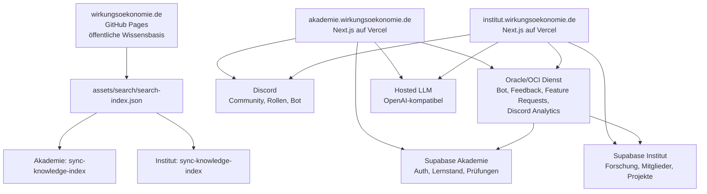

# Claude Architecture Handoff: WÖk-Institut

Stand: 2026-07-03  
Geplante öffentliche Domain: `https://institut.wirkungsoekonomie.de`  
Bestehende Referenzarchitektur: `<Projekt-Root>/woek-akademie-app`  
Öffentliche Website / Wissensbasis: `<Projekt-Root>`

Dieses Dokument ist die technische Übergabe für Claude. Ziel ist ein Institut neben der Akademie, aber kein isolierter Neubau: Das Institut soll die vollständige bestehende Architektur nutzen können, inklusive Vercel, Supabase, Discord, Website-Wissensbasis, WÖk-KI/Hosted LLM, Oracle-Bot/Oracle-Feedback, First-Party-Analytics und später gemeinsamen Zertifikats-/Verifikationsmustern.

## 0. Konzept-Dokumente und geklärte Entscheidungen

Dieses Handoff beschreibt die **Infrastruktur**. Das fachliche Konzept, das Datenmodell und der
Arbeitsprozess stehen in eigenen Dokumenten und sind die verbindliche Grundlage für den Bau:

- `docs/institut-gesamtkonzept.md` — Module, Arbeitsbereiche, Projektwerkstatt, Transparenzmodell, Rollen, MVP-Staging
- `docs/institut-datenmodell.md` — Mandantenmodell, `institut_*`-Tabellen, RLS, Migrations-Konvention
- `docs/institut-arbeitsteilung-claude-codex.md` — Prozess, Definition of Done, Guardrails
- `docs/institut-entscheidungen.md` — Decision-Log und Worklog

**Geklärte Entscheidungen (2026-07-03, mit Natalie abgestimmt — Details im Decision-Log):**

- **E1 Domain:** `institut.wirkungsoekonomie.de` (bestätigt).
- **E2 Reihenfolge:** erst Fundament dokumentieren, dann bauen.
- **E3 Supabase:** **gemeinsames** Projekt wie die Akademie mit **Mandantenmodell** (`institut_*`-Tabellen + RLS, keine Akademie-Tabelle wird verändert, Auth geteilt).
- **E4 Repo:** eigenes GitHub-Repo `woek-institut-app`.
- **E5 Transparenz:** 3-stufig (`public`/`members`/`internal`) + öffentliche Statuslogik.
- **E6 Rollen:** `member`/`researcher`/`reviewer`/`editor`/`governance`/`admin`.

Damit sind die früher offenen Punkte zu Supabase und Repo (siehe §15) entschieden.

## 1. Leitentscheidung

Das Institut wird als eigener App-/Portal-Strang aufgebaut, aber architektonisch aus der Akademie-App abgeleitet.

Empfehlung:

- Neues App-Projekt/Repo: `woek-institut-app`
- Hosting: Vercel
- Domain: `institut.wirkungsoekonomie.de`
- Framework: Next.js App Router wie Akademie-App
- Auth/Datenbank: Supabase
- Community-/Rollenanbindung: Discord optional oder rollenbasiert, aber nicht als alleinige Wahrheitsquelle
- Oracle/OCI: externer Bot-/Feedback-/Analytics-Dienst, nicht Ersatz für Supabase
- Website-Wissensbasis: Synchronisation aus `wirkungsoekonomie.de`

Nicht empfohlen:

- Keine hart codierte Sonderseite in der statischen Hauptwebsite als Ersatz für die Institut-App.
- Keine IONOS-Weiterleitung als Dauerlösung.
- Keine Vermischung von Akademie-Lernständen und Institut-Forschungs-/Mitgliedsdaten in denselben Tabellen ohne bewusstes Mandantenmodell.
- Keine Personenbewertung, kein Social Credit, keine öffentliche Rangliste von Menschen.

## 2. Aktueller Infrastrukturstatus

### IONOS / DNS

`institut.wirkungsoekonomie.de` ist bei IONOS angelegt und aktuell gültig auf Vercel geroutet.

Aktueller IONOS-Record:

```text
A institut -> 76.76.21.21
```

Die alten IONOS-Default-Site-Records für `institut` wurden deaktiviert:

- `A institut -> 217.160.0.195`
- `AAAA institut -> 2001:8d8:100f:f000::200`
- interner `_dep_ws_mutex.institut`-TXT der Default Site

Mailbezogene Records für `institut` blieben bestehen:

- `MX institut -> mx00.ionos.de`
- `MX institut -> mx01.ionos.de`
- `TXT institut -> "v=spf1 include:_spf-eu.ionos.com ~all"`
- DKIM-/Autodiscover-Records unter `*.institut`

Vercel akzeptiert die aktuelle A-Record-Konfiguration. Optional empfiehlt Vercel später einen CNAME:

```text
CNAME institut -> 62876cc1402c24b7.vercel-dns-017.com.
```

Wichtig: CNAME und gleichnamige MX/TXT/A-Records können nicht parallel auf `institut` existieren. Wenn Mail unter `institut.wirkungsoekonomie.de` erhalten bleiben soll, ist der aktuelle A-Record die verträglichere Variante.

### Vercel

Vercel-Team/Scope: `<vercel-team-scope>`  
Bestehendes Akademie-Projekt: `woek-akademie-app`  
Neues Institut-Projekt: `woek-institut-app`

Vercel-Projektstatus:

```text
Project: woek-institut-app
ID: <vercel-project-id>
Node.js: 24.x
Domain attached: institut.wirkungsoekonomie.de
Domain status: valid, configured by A
```

Das Projekt ist derzeit nur als Ziel vorbereitet. Claude muss noch Code/Repo anbinden oder das App-Projekt aus einem neuen lokalen Projekt deployen.

Prüfkommandos:

```bash
npx --yes vercel project inspect woek-institut-app --scope <vercel-team-scope> --non-interactive
npx --yes vercel domains verify institut.wirkungsoekonomie.de --scope <vercel-team-scope> --non-interactive
dig +short institut.wirkungsoekonomie.de A @ns1020.ui-dns.biz
```

## 3. Repository- und Arbeitsmodell

Es gibt derzeit zwei relevante Codebasen:

### Öffentliche Website

- Pfad: `<Projekt-Root>`
- Remote: `https://github.com/sustynats/wirkungsoekonomie.de.git`
- Hosting: GitHub Pages
- Domain: `https://wirkungsoekonomie.de`
- Funktion: öffentliche Wissensbasis, Glossar, Suche, Wirkungsfelder, Werkzeuge, Zertifikats-Verifikation, Downloads, Journal.

### Akademie-App als Referenz

- Pfad: `<Projekt-Root>/woek-akademie-app`
- Remote: `https://github.com/sustynats/woek-akademie-app.git`
- Hosting: Vercel
- Domain: `https://akademie.wirkungsoekonomie.de`
- Funktion: geschützte Next.js-App mit Supabase, Discord, Curriculum, Prüfungen, Dozentinnenbereich, Analytics, WÖk-KI Beta und Oracle-Anbindung.

### Institut-App als Ziel

Empfohlener lokaler Pfad:

```text
<Projekt-Root>/woek-institut-app
```

Wenn Claude ein neues Repo anlegt, soll es bewusst parallel zur Akademie-App liegen. Wenn Code aus der Akademie-App übernommen wird, dann als sauberer Fork/Scaffold, nicht durch unsichtbares Kopieren einzelner Dateien ohne Herkunft.

Vor jeder Arbeit:

```bash
cd "<Projekt-Root>"
git status --short
git -C woek-akademie-app status --short
test -d woek-institut-app && git -C woek-institut-app status --short || true
```

Zuerst lesen:

- `<Projekt-Root>/AGENTS.md`
- `<Projekt-Root>/woek-akademie-app/README.md`
- `<Projekt-Root>/woek-akademie-app/docs/claude-architecture-handoff.md`
- `<Projekt-Root>/woek-akademie-app/.env.example`
- dieses Dokument

## 4. Architekturziel



Leitbild:

- Website ist Quelle und öffentliche Referenz.
- Akademie ist Lern-, Prüfungs- und Zertifikatsplattform.
- Institut ist Forschungs-, Standardisierungs-, Publikations-, Projekt- und Governance-Plattform.
- Oracle liefert Bot-/Feedback-/Analytics-Daten und kann später weitere Dienste übernehmen, ersetzt aber nicht die fachliche Primärdatenhaltung in Supabase.

## 5. Funktionsumfang Institut

Das Institut soll später mindestens diese Module tragen können:

- öffentliche Institutsseite mit Auftrag, Arbeitsweise, Ethik und Abgrenzung
- geschützter Institutsbereich für Team, Forschung, Review und Governance
- Forschungs- und Arbeitsprogramm
- Projekt-/Pilotregister
- Publikations- und Working-Paper-Workflow
- Review- und Feedbackstrecken
- Quellen-/Evidenzregister
- WÖk-ID-/Indikatorenbezug
- KI-gestützte Recherche über Website-Wissensbasis und Institutskorpus
- Discord-Community-/Arbeitsgruppenanbindung
- Oracle-Bot-Integration für Feedback, Feature Requests und Discord-Analytics
- datensparsame First-Party-Analytics
- optional: Zertifikats-/Bestätigungslogik für Institutspublikationen, Reviews oder Arbeitsgruppen, aber klar getrennt von Akademie-Abschlüssen

## 6. Daten- und Mandantengrenzen

Claude soll die Akademie-Architektur wiederverwenden, aber Datenräume trennen.

Entscheidung E3 (2026-07-03): **gemeinsames** Supabase-Projekt wie die Akademie mit striktem
Mandantenmodell. Details und Tabellen in `docs/institut-datenmodell.md`. Kurzfassung:

- Alle Institut-Objekte tragen das Präfix `institut_*` im `public`-Schema; RLS pro Tabelle.
- Institut-Migrationen erstellen nur `institut_*`-Objekte und **verändern niemals** eine
  Akademie-Tabelle. Auth-User werden geteilt (dieselbe Supabase Auth).
- Migrations-Präfix `institut_NNNN_*` (eigener Nummernkreis, kollisionsfrei zur Akademie).
- Niemals Akademie-Prüfungsdaten mit Institutsbewertungen oder Forschungsentscheidungen vermischen.

Führende Daten:

- Akademie: Lernstand, Prüfungen, Zertifikate, Dozentinnenentscheidungen.
- Institut: Forschungsprojekte, Arbeitsgruppen, Publikationen, Reviews, Quellen, Governance-Entscheidungen.
- Website: öffentliche Inhalte, Suchindex, Glossar, statische Sonderzertifikate.
- Oracle: Bot-/Feedback-/Analytics-Ereignisse und externe Service-Antworten, nicht alleinige System-of-Record-Datenbank.

## 7. Auth, Rollen und Discord

Das Institut darf Discord nutzen, soll aber nicht automatisch jede Discord-Rolle als fachliche Institutsentscheidung behandeln.

Mögliche Rollen:

- `institut_member`: Zugang zum geschützten Institutsbereich
- `researcher`: Mitarbeit an Forschungs-/Dossierprojekten
- `reviewer`: Review und Qualitätskommentare
- `editor`: Publikationspflege
- `governance`: Freigaben, Arbeitsprogramm, sensible Einstellungen
- `admin`: technische Administration

Discord kann diese Rollen spiegeln oder initial vergeben. Supabase bleibt führend für:

- personenbezogene Berechtigungen
- Freigaben
- Audit-Logs
- Review-Status
- institutionelle Rollen außerhalb von Discord

Wenn Discord optional werden soll, soll Claude die Auth-Logik der Akademie-App in Richtung E-Mail/Google/Microsoft/Discord Multi-Provider weiterentwickeln, nicht auf Discord-Pflicht verhärten.

## 8. Oracle / OCI und Bot-Anbindung

Bestehender Status aus der Akademie-App:

- `WOEK_ORACLE_API_URL=https://<oracle-endpoint>`
- `WOEK_FEEDBACK_ADMIN_TOKEN` für Feedback-/Faktencheck-/WÖk-KI-Service
- `DISCORD_ANALYTICS_INGEST_TOKEN` für Bot-Ingest in die App
- Oracle-Bot kann Discord-Server-Analytics liefern
- Migration `supabase/migrations/0016_discord_server_analytics.sql` enthält Tabellen für Discord-Events und Snapshots

Institut-Ziel:

- eigener Ingest-Endpunkt, z. B. `/api/discord-analytics/ingest`
- eigener Token für Institut, nicht Akademie-Token wiederverwenden
- optional eigene Bot-Feature-Labels für Institutsfunktionen
- getrennte Datenhaltung in Instituts-Supabase oder mandantensicherer Tabelle
- keine Discord-Nachrichtentexte speichern
- keine Direktnachrichten speichern
- keine IP-Adressen oder Standortdaten aus Discord
- keine Personenranglisten

Empfohlene Env für das Institut:

```text
WOEK_ORACLE_API_URL=https://<oracle-endpoint>
WOEK_FEEDBACK_ADMIN_TOKEN=<server-only>
DISCORD_ANALYTICS_INGEST_TOKEN=<server-only, institute-specific>
DISCORD_ANALYTICS_HASH_SALT=<server-only, institute-specific>
```

Auf Oracle/Bot-Seite entsprechend:

```text
DISCORD_ANALYTICS_ENABLED=true
DISCORD_ANALYTICS_ENDPOINT_URL=https://institut.wirkungsoekonomie.de/api/discord-analytics/ingest
DISCORD_ANALYTICS_INGEST_TOKEN=<same-token>
DISCORD_ANALYTICS_HASH_SALT=<same-or-coordinated-salt>
DISCORD_ANALYTICS_MEMBER_EVENTS_ENABLED=true
```

Wenn Claude Oracle erweitert, muss dokumentiert werden:

- Dienstname und Zweck
- OCI-Region und Deployment-Art
- API-Endpunkte
- Secret-Quellen
- Datenarten
- Speicherorte
- Lösch- und Backup-Konzept
- Datenschutzgrenzen
- Verantwortlichkeit

## 9. WÖk-KI und Wissensbasis

Die Akademie-App nutzt den Website-Suchindex:

```text
<Projekt-Root>/assets/search/search-index.json
```

Das Institut soll denselben Mechanismus erhalten und später um ein Institutskorpus erweitern:

- Website-Suchindex als öffentliche Grundwissensbasis
- Institutskorpus für Arbeitsprogramme, Quellenregister, Projektberichte, Reviews
- klare Quellenanzeige
- Fallback ohne LLM: Retrieval-only mit Fundstellen
- keine ungeprüfte Vermischung von Modell, Demo, Arbeitspapier und normativer Aussage

Env-Muster aus der Akademie-App:

```text
WOEK_LLM_PROVIDER=together
WOEK_LLM_BASE_URL=https://api.together.ai/v1
WOEK_LLM_MODEL=openai/gpt-oss-20b
WOEK_LLM_API_KEY=<server-only>
WOEK_PUBLIC_SITE_URL=https://wirkungsoekonomie.de
WOEK_KNOWLEDGE_INDEX_PATH=data/woek-search-index.json
```

Für das Institut:

```text
NEXT_PUBLIC_APP_URL=https://institut.wirkungsoekonomie.de
WOEK_PUBLIC_SITE_URL=https://wirkungsoekonomie.de
WOEK_INSTITUT_SITE_URL=https://institut.wirkungsoekonomie.de
WOEK_KNOWLEDGE_INDEX_PATH=data/woek-search-index.json
WOEK_INSTITUT_CORPUS_PATH=data/institut-search-index.json
```

## 10. Analytics

Akademie-Referenz:

- `/api/site-event`
- `/api/academy-event`
- `/api/discord-analytics/ingest`
- Supabase-Migrationen `0002`, `0014`, `0016`

Institut-Ziel:

- `/api/site-event` für öffentliche Institutsseiten
- `/api/institut-event` für interne Aktionen
- `/api/discord-analytics/ingest` für Oracle-Bot
- Dashboard nur für berechtigte Rollen

Datenschutzgrenzen:

- datensparsam
- serverseitig
- keine Werbenetzwerke
- keine Google-Analytics-Pflicht
- keine IP-Adressen im fachlichen Datenmodell
- keine Re-Identifikation aus Aggregaten
- keine öffentliche Personenrangliste

## 11. Zertifikate, Bescheinigungen und Verifikation

Das Institut darf Zertifikatsmuster wiederverwenden, aber nicht die Akademie-Abschlüsse verwässern.

Trennung:

- Akademie-Zertifikate: Lern-/Prüfungsnachweise.
- Website-Sonderzertifikate: private QR-/ID-Verifikation, aktuell manuell/statisch.
- Institut-Bescheinigungen: z. B. Review-Beteiligung, Arbeitsgruppenmitgliedschaft, Publikationsfreigabe oder Projektstatus.

Leitlinie:

- Keine amtliche Akkreditierung suggerieren.
- Keine Personenbewertung.
- Keine moralische Rangliste.
- Bei Review-/Projektstatus immer als Modell, Arbeitspapier, Demo, Pilot oder Institutsprozess kennzeichnen, wenn noch nicht final.

## 12. Inhaltliche WÖk-Leitplanken

Claude muss die WÖk-Begriffe sauber halten:

- Wirkung ist neutral und relational.
- Wirkung bedeutet tatsächliche Veränderung von Zuständen.
- Wirkung, Wirkungspotenzial und Wirkungsrisiko klar unterscheiden.
- Positive Wirkung am Referenzrahmen SDGs, Agenda 2030 und SDG+ bewerten.
- Bei Zielgröße: positive Netto-Wirkung.
- Reichweite ist nicht Wirkung.
- Reporting ist nicht Rückkopplung.
- Nichtkompensation und Reverse Merit Order nennen, wenn Steuerungslogik, Bewertung oder Priorisierung beschrieben werden.
- WÖk ist keine Planwirtschaft, keine Sprachpolizei und kein Social-Credit-System.
- Keine Personenbewertung, keine moralische Rangliste von Menschen.
- Modellhafte Inhalte als Modell, Demo, Entwurf oder Arbeitspapier kennzeichnen.

## 13. Implementierungsplan für Claude

Phase 0: Orientierung

- Dieses Dokument lesen.
- Akademie-Handoff lesen.
- `woek-akademie-app` lokal bauen/testen, um die Referenzarchitektur zu verstehen.
- Vercel-/IONOS-Status nicht neu erfinden.

Phase 1: Institut-App scaffen

- Neues Projekt `woek-institut-app` anlegen oder aus Akademie-App bewusst ableiten.
- Next.js App Router, TypeScript, Supabase-Clients, Auth-Guards, Analytics-Grundstruktur übernehmen.
- Branding/Navigation klar als Institut, nicht Akademie.
- `NEXT_PUBLIC_APP_URL=https://institut.wirkungsoekonomie.de`

Phase 2: Datenmodell

- Institutstabellen entwerfen:
  - `institut_users`
  - `institut_roles`
  - `research_projects`
  - `working_groups`
  - `publications`
  - `review_tasks`
  - `evidence_sources`
  - `governance_decisions`
  - `institut_activity_events`
  - `discord_server_events` / `discord_server_snapshots` oder mandantensichere Wiederverwendung
- RLS und Admin-Service-Role sauber trennen.

Phase 3: Oracle/Discord

- Discord-OAuth/Bot-Anbindung nach Akademie-Muster.
- Oracle-Ingest-Endpunkt für Institut.
- Eigene Tokens und Hash-Salts.
- Datenschutznotiz für Institut ergänzen.

Phase 4: Wissensbasis/KI

- Website-Index synchronisieren.
- Institutskorpus ergänzen.
- Retrieval-only-Fallback erhalten.
- Hosted LLM serverseitig einbinden.

Phase 5: Deployment

- Vercel-Projekt `woek-institut-app` mit Repo verbinden.
- Environment Variables setzen.
- Preview und Production testen.
- Domain `institut.wirkungsoekonomie.de` verifizieren.
- Keine Änderung an `wirkungsoekonomie.de` oder `akademie.wirkungsoekonomie.de`, außer bewusst dokumentiert.

## 14. Abnahmekriterien

Minimum für eine erste technische Abnahme:

- `https://institut.wirkungsoekonomie.de` liefert eine echte Institut-App, keine IONOS-Defaultseite.
- Vercel Domain Verification ist ok.
- Auth- und Rollenmodell ist dokumentiert.
- Supabase-Migrationen sind versioniert.
- Keine Secrets im Repo.
- Oracle- und Discord-Endpunkte sind token-geschützt.
- Datenschutznotiz für Analytics/Discord/Oracle liegt vor.
- Website-Wissensbasis kann synchronisiert werden.
- Build, Typecheck und relevante Tests laufen.

## 15. Offene Entscheidungen

Entschieden (Details in `docs/institut-entscheidungen.md`):

- ✅ Supabase-Projekt vs. Shared-Betrieb → **gemeinsam + Mandantenmodell** (E3).
- ✅ Eigenes Repo vs. Monorepo → **eigenes Repo `woek-institut-app`** (E4).

Noch offen (geführt als O1–O6 im Decision-Log):

- O1 Soll Discord beim Institut Pflicht, optional oder nur Community-Spiegel sein?
- O5 Welche Institutsrollen sollen auf Discord gespiegelt werden?
- O2 Soll Oracle führende Quelle für Feature Requests bleiben oder nur Ingest/Fallback?
- O3 Soll das Institut eigene Publikations-Verifikationsseiten bekommen?
- O4 Soll `institut.wirkungsoekonomie.de` langfristig per A-Record bleiben oder auf Vercel-CNAME umgestellt werden, falls Mail unter der Subdomain nicht gebraucht wird?
- O6 Bleibt das `institut_*`-Präfix dauerhaft oder erfolgt später ein Umzug in ein eigenes Schema `institut`?
