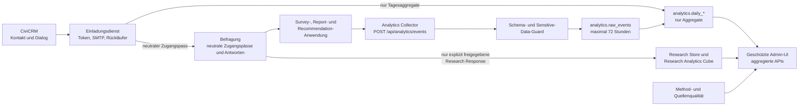

# Analytics-Backend: Bestandsaufnahme und Umsetzungsvorschlag

Stand: 13. August 2026
Status: Architekturvorschlag mit implementiertem Collector-Grundgerüst

## Ergebnis

Das Analytics-Backend wird als eigener, selbst gehosteter Dienst in der
Wahlkreis-Wirkungscheck-Umgebung gebaut. Es verwendet weder CiviCRM noch LimeSurvey noch das
bestehende Institut-/Akademie-Analytics als Datenspeicher oder Event-Endpunkt.

Das ist erforderlich, weil die bestehenden Systeme die hier verlangte Zwecktrennung nicht
leisten: CiviCRM enthält Kontakt- und Dialogdaten, LimeSurvey enthält anonyme Antworten; das
vorhandene Institut-Analytics akzeptiert beliebige `meta`-Objekte und kann Subjekt-IDs speichern.
Das ältere Akademie-Webanalytics verarbeitet zudem Session-, User-Agent- und Geo-Daten. Keines
dieser Muster wird für den Wahlkreis-Wirkungscheck übernommen.

## Bestandsaufnahme

| Bereich | Gefundener Stand | Entscheidung |
| --- | --- | --- |
| Kontakt- und Dialogdaten | Neu eingerichtetes CiviCRM mit eigener MySQL-Datenbank | Nur für Kontakte und dialogische Vorgänge, nie für Antwort- oder Product-Analytics |
| Befragung | Neu eingerichtetes LimeSurvey mit eigener MariaDB-Datenbank | Nur neutrale Zugangspässe und Antworten, keine Namen, E-Mails oder Einladungsdaten |
| Einladungsdienst | Noch nicht implementiert | Muss den datensparsamen Token-Gateway und aggregierte Zustellmetriken bereitstellen |
| Survey-, Report- und Recommendation-Anwendung | Noch nicht vorhanden | Muss vor der produktiven Analytics-Integration als eigener Produktpfad gebaut werden |
| Institut-App | Next.js/Supabase, getrenntes unversioniertes Arbeitsverzeichnis | Nicht als Analytics-Host für diese Befragung verwenden |
| Bestehendes Institut-Event-Stub | `POST /api/institut-event`, beliebiges `meta`, optionale Subjekt-ID | Für den Wirkungscheck gesperrt, nicht wiederverwenden |
| Akademie-Webanalytics | Supabase-Rohereignisse mit Session-/Browser-/Geo-Metadaten | Nicht wiederverwenden, da nicht mit dieser strengen Datenminimierung vereinbar |
| Monitoring | Container- und Reverse-Proxy-Logs; kein passendes Analytics- oder Disclosure-Control-System | Security-Logging bleibt künftig vom Analytics-Datenspeicher getrennt |

Es gibt derzeit keine Wahlkreis-spezifische Recommendation Engine, keinen Report Builder und
keine bestehende administrative Analytics-UI. Deshalb wird keine scheinbare Kompatibilität mit
einer vorhandenen Anwendung behauptet.

## Zielarchitektur



### Feste Grenzen

1. Der Collector erhält nie E-Mail, Name, Partei, Fraktion, Einladungstoken, Survey-Response-ID,
   exakten Wahlkreis, Antwortwert, Freitext, Recommendation-ID, IP-Adresse oder rohen User-Agent.
2. Der Einladungsdienst liefert an Analytics ausschließlich Tagesaggregate wie `sent`,
   `hard_bounces` und `redeemed`. Es gibt keinen Empfänger-Export und keinen CRM-Zugriff des
   Analytics-Dienstes.
3. LimeSurvey erhält nur neutrale Zugangspässe. Es gibt keine Datenbankverbindung, API oder
   gemeinsamen Schlüssel zwischen LimeSurvey und dem Einladungs- bzw. Analytics-Dienst.
4. Der Product-Analytics-Nonce ist eine zufällige, nur in `sessionStorage` liegende Kennung. Er
   ist weder Survey-Session noch Zugangspass, Einladungs- oder Report-ID und wird nach der
   Aggregation gelöscht.
5. Security Logs, Reverse-Proxy-Logs und Abuse-Erkennung bleiben technisch und organisatorisch
   getrennt. Sie werden nicht als Product Analytics weiterverarbeitet.

## Vorgeschlagene selbst gehostete Komponenten

Die bestehende Docker-Umgebung wird erst nach der Architekturfreigabe um zwei Dienste ergänzt:

- `analytics-api`: ein kleiner TypeScript-Service mit fest typisiertem Event-Registry,
  serverseitigem Guard, RBAC und ausschließlich aggregierten Admin-APIs.
- `analytics-db`: PostgreSQL mit privaten Schemas und einem eigenen Datenbankkonto. CiviCRM
  (MySQL) und LimeSurvey (MariaDB) erhalten weder Tabellen noch Berechtigungen darin.

PostgreSQL wird gewählt, weil die geforderten getrennten Schemas, Transaktionen für Aggregation,
RLS-nahe Datenbankrechte, Retention-Jobs und Disclosure-Control-Abfragen damit sauber abbildbar
sind. Es wird keine Analytics-SaaS eingeführt.

### Datenbankschemas

| Schema | Inhalt | Zugriffsgrenze |
| --- | --- | --- |
| `analytics` | kurzlebige Rohereignisse, Deduplizierung, tägliche Product-Aggregate | Analytics-Service und Retention-Job |
| `research_analytics` | nur disclosure-kontrollierte Research-Cubes | Research-Job und berechtigte Research-APIs |
| `method_analytics` | Methodenabdeckung, Neutralitätstests, Quellenalter | Method- und Quellenjobs |
| `privacy_ops` | Löschjob-Status, Privacy-Operationen, Retention-Health | Privacy Officer |
| `security_monitoring` | minimale Security-Alerts ohne beanstandeten Payload | Security Admin |

Der Research Store selbst bleibt zusätzlich vom Research-Cube getrennt. Das Dashboard liest nie
direkt aus Research-Row-Level-Antworten.

## Collector und Datenminimierung

Der alleinige öffentliche Product-Analytics-Endpunkt lautet:

```text
POST /api/analytics/events
```

Er akzeptiert ausschließlich im Event-Katalog definierte Events und strikt typisierte Felder.
Unbekannte Felder, unbekannte Events, falsche Versionsnummern und nicht registrierte
`pageKey`-/`questionType`-Werte werden mit `400` verworfen. Ein generischer Payload, freie
Metadatenfelder oder ein serverseitiges Nachreichen zusätzlicher Informationen sind verboten.

Vor einer Speicherung prüft ein Sensitive-Data-Guard sowohl Feldnamen als auch Werte. Der Guard
erkennt insbesondere E-Mail-Muster, Tokens, IDs aus den anderen Datenräumen und alle in der
Vorgabe verbotenen Schlüssel. Bei einem Verstoß wird das Ereignis vollständig verworfen. Der
Security-Alert enthält nur eine Fehlerklasse, Zeit und eine zufällige Alert-ID, nie den Payload.

Die Deduplizierung verwendet nur `(analytics_session_nonce, client_event_id)` für höchstens
72 Stunden. Danach werden Rohereignis und Nonce durch den Retention-Job gelöscht; die täglichen
Aggregate enthalten keine Nonce.

## Research, Disclosure Control und Exporte

Research Analytics wird erst ausgelöst, wenn eine separate, dokumentierte Research-Freigabe
vorliegt. Der One-Way-Job übergibt dann nur freigegebene Forschungsdaten an den Research Store.
`ENABLE_PARTY_RESEARCH_ANALYTICS=false` bleibt der Produktionsstandard; Parteidaten gehören nie
in die Recommendation Engine.

Jede Research-Abfrage, jeder CSV- und PDF-Export durchläuft serverseitig den
`CohortDisclosureGuard` mit `MIN_ANALYTICS_COHORT_SIZE=10` und anschließender
Sekundärunterdrückung. Die UI kann eine Zelle deshalb nicht durch eine andere API oder einen
Export umgehen. Query-Parameter sind auf Zeitraum, Studie/Welle und höchstens zwei bis drei
registrierte Dimensionen begrenzt.

## Rollen und Admin-Oberfläche

Die Admin-UI erhält getrennte, serverseitig geprüfte Rollen:

- `ANALYTICS_VIEWER`
- `RESEARCH_ANALYST`
- `METHODOLOGY_ANALYST`
- `DATA_MANAGER`
- `PRIVACY_OFFICER`
- `SECURITY_ADMIN`

Alle Endpunkte sind standardmäßig aggregiert. Es wird insbesondere keinen Endpunkt geben, der
Einladung, Antwort, Report und Research-Freigabe zu einem Personenprofil zusammenführt.

## Umsetzungsetappen

1. Event-Katalog, Metrik-Definitionen, Retention und RBAC verbindlich versionieren.
2. Eigenen Analytics-Dienst mit PostgreSQL-Migrationen, Collector, Guard und Retention-Job bauen.
3. Zunächst mit synthetischen Fixtures testen. Keine Produktivdaten und keine IONOS- oder
   CiviCRM-Zugangsdaten verwenden.
4. Einladungsdienst mit ausschließlich aggregiertem Metrik-Adapter ergänzen.
5. Survey-/Report-/Recommendation-Anwendung integrieren, aber nur über den geprüften Collector.
6. Geschützte Admin-UI, Research-Cube und Method-/Quellenjobs anschließen.
7. Vor Livegang die Launch-Gates aus `ANALYTICS_TESTING.md` und die Datenschutzprüfung
   nachweisbar abschließen.

## Entscheidende Launch-Gates

Kein Produktionsstart, solange einer der folgenden Punkte offen ist:

- Product Analytics kann Antwortwerte oder Identitätsdaten annehmen;
- Einladungs- und Survey-Daten sind technisch joinbar;
- Rohereignisse oder Nonces nicht automatisch nach 72 Stunden gelöscht werden;
- Cohort- und Sekundärunterdrückung nicht serverseitig arbeiten;
- Export, RBAC, Metrik-Tests oder Neutralitätstests fehlen;
- Test- und Produktivdaten nicht getrennt sind;
- Quellen- und Retention-Health nicht sichtbar sind.

Implementiert sind inzwischen der isolierte Collector, der strikte Event- und Sensitive-Data-
Guard, die kurzlebige Rohablage, tägliche Product-Aggregate, Deduplizierung, 72-Stunden-Purge,
Metrikregistry und die wiederverwendbare Disclosure-Control-Kernlogik. Ohne die noch fehlende
Survey-/Report-Anwendung ruft niemand den Endpoint auf; es werden somit keine echten
Analytics-Daten erhoben. Research-Cube, Method-/Quellenjobs, Admin-UI, Admin-Authentisierung und
Exports bleiben ausdrücklich vor dem Produktivstart umzusetzen.
