# Versand- und Kommunikationsarchitektur: Wahlkreis-Wirkungscheck

Stand: 13. August 2026
Status: technische Grundlage, kein Produktivversand freigegeben

## Zweck und Grundsatz

Die Einladungen sind eine parteiunabhängige, institutionelle Ansprache von Mitgliedern des
Deutschen Bundestages. Sie sind kein Newsletter und keine Marketingkampagne. Die Architektur
ermöglicht eine korrekte Zustellung, einen erreichbaren Dialog und eine sichere Teilnahme, ohne
Öffnungen, Klicks, politische Positionen oder Umfrageantworten als Kommunikationsprofil zu
erfassen.

Für den späteren Versand ist folgende Absenderidentität festgelegt:

```text
Institut für Wirkungsökonomie | Wahlkreis-Wirkungscheck
wirkungscheck@wirkungsoekonomie.de
```

Der sichtbare `From` lautet entsprechend `Institut für Wirkungsökonomie | Wahlkreis-Wirkungscheck
<wirkungscheck@wirkungsoekonomie.de>`; `Reply-To` verweist auf dieselbe betreute Adresse.
`institut.wirkungsoekonomie.de` ist die institutionelle Webadresse, nicht die technische
Versandmailbox. Die persönliche Absenderin ist Natalie Weber und wird in der Signatur genannt;
die technische Mailbox bleibt unverändert.
Das Impressum und die Datenschutzerklärung nennen vor dem Versand die tatsächlich verantwortliche
Rechtsperson. Es wird keine Rechtsform behauptet, die nicht besteht.

**Status:** Das ist eine Vorgabe für die noch ausstehende Versandfreigabe. Die vorhandene IONOS-
Mailbox wird weder geändert noch zum Versand verwendet, bis DNS-Authentisierung und der rechtliche
Versandprozess ausdrücklich freigegeben wurden.

## Getrennte Systeme

```mermaid
flowchart LR
  crm["CiviCRM\nDialog und Ansprechpartner"] -->|"minimierter, freigegebener Export"| invite["Invitation Service\nRecipient DB, Queue, Suppressions"]
  invite -->|"SMTP über IONOS\nkein Open-/Click-Tracking"| mailbox["MdB-Büro"]
  mailbox -->|"kryptografischer Einladungstoken"| eligibility["Eligibility Service\nToken eingelöst / nicht eingelöst"]
  eligibility -->|"neutraler Survey Pass"| survey["Survey Service\nkeine Empfängeridentität"]
  survey --> report["Report / Recommendation Service\nAntworten und Kontext"]
```



| System | Darf wissen | Darf nicht wissen |
| --- | --- | --- |
| CiviCRM | offizielle Kontaktdaten, Dokumentation von Dialogvorgängen | Umfrageantworten, Report, politische Bewertung |
| Invitation Service | wen wir einladen, Versand- und Unterdrückungsstatus | Antworten, Report, politische Prioritäten |
| Eligibility Service | Token gültig, eingelöst oder unterdrückt | Name, E-Mail, Antworten |
| Survey Service | neutraler Survey Pass und Antworten | Empfängeridentität, ursprünglicher Einladungstoken |
| Report Service | Antworten und zulässige Wahlkreisdaten | E-Mail-Adresse und CRM-Kontakt |

Ein automatischer Datenabzug aus der Befragung nach CiviCRM ist ausgeschlossen. Ein späterer
Dialogeintrag in CiviCRM erfolgt nur auf einer separaten, klaren Kontaktgrundlage, etwa auf
ausdrücklichen Wunsch nach weiterem Austausch.

## Komponenten und Betriebsstand

Die operative Grundumgebung ist im Repository unter
`ops/wahlkreis-wirkungscheck/` dokumentiert. Sie enthält:

- CiviCRM mit separater MySQL-Datenbank für Kontakt- und Dialogverwaltung;
- LimeSurvey mit separater MariaDB für die Befragung;
- Caddy als TLS-Reverse-Proxy für getrennte Subdomains;
- eine nicht versionierte Secret-Datei, getrennte persistente Volumes sowie Backup- und
  Vorprüfungsabläufe.

Vor dem ersten realen Versand wird zusätzlich ein kleiner Invitation-/Eligibility-Service gebaut.
Er ist kein Marketing-Tool: Er enthält nur die in
[`INVITATION_DATA_FLOW.md`](INVITATION_DATA_FLOW.md) beschriebenen Tabellen und Operationen. Erst
er erzeugt Token, versendet Wellen, verarbeitet Suppressions und entkoppelt den LimeSurvey-Zugang
von der Empfängeridentität.

## Transport und Mailbox

Die eingerichtete IONOS-Mailbox wird wie folgt verwendet:

| Zweck | Einstellung |
| --- | --- |
| SMTP | `smtp.ionos.de`, Port 587, STARTTLS, Authentifizierung |
| SMTP-Benutzer | `wirkungscheck@wirkungsoekonomie.de` |
| Rückläufer / Antworten | `imap.ionos.de`, Port 993, SSL |
| Sichtbarer Absender | `Institut für Wirkungsökonomie | Wahlkreis-Wirkungscheck <wirkungscheck@wirkungsoekonomie.de>` |
| Reply-To | `wirkungscheck@wirkungsoekonomie.de` |

Das IONOS-Passwort wird ausschließlich als Server-Secret bzw. in den geschützten
Systemeinstellungen gespeichert. Es gehört weder in Git noch in die Website noch in eine
Client-Anwendung. Eingehende Antworten gehen an ein tatsächlich betreutes Postfach; es gibt keine
`no-reply`-Adresse.

## Versandregeln

- Es gibt keine Trackingpixel, Link-Redirects, UTM-Parameter mit Personenbezug, Werbenetzwerke,
  Heatmaps oder Öffnungs-/Klickprotokolle.
- E-Mails enthalten HTML **und** vollständigen Plain Text. Externe Bilder sind nicht erforderlich.
- Die Personalisierung beschränkt sich auf Anrede, Name, gegebenenfalls Wahlkreis und den
  Berechtigungstoken. Sie nutzt keine Partei, Position, Social-Media-Daten oder Prognose.
- Anhänge, Office-Dokumente, Archive, URL-Shortener und fremde Login-Seiten werden nicht
  eingesetzt.
- Die öffentliche Zieladresse bleibt sichtbar auf `wirkungsoekonomie.de`; ein Token ist der einzige
  notwendige individuelle Bestandteil des direkten Links.
- Empfänger, Betreff, Template und Header werden serverseitig validiert. CR/LF in Headerfeldern
  wird abgewiesen.

## Konfigurationswerte des Invitation Service

```text
EMAIL_SEND_MODE=test | production
MAX_EMAILS_PER_MINUTE=<freigegebener Wert>
MAX_EMAILS_PER_HOUR=<freigegebener Wert>
MAX_EMAILS_PER_DAY=<freigegebener Wert>
MAX_SOFT_BOUNCE_RETRIES=2
REMINDER_LIMIT=1
```

Im Testmodus ist der Versand auf eine explizite Testliste begrenzt. `production` wird nicht durch
eine normale UI-Aktion gesetzt, sondern nur nach Versandvorschau, Testmail und zweiter Bestätigung.
Ein vollständiger Versand verlangt die explizite Zeichenfolge `CONFIRM PRODUCTION SEND` durch eine
zweite berechtigte Person.

## CRM-Einsatz

CiviCRM verwaltet die langfristige Beziehung, nicht das Antwortprofil. Für die erste Importgruppe
werden mindestens `offizielle E-Mail`, `Name`, `Anrede`, `Wahlkreisreferenz`, `Datenquelle`,
`Abrufdatum` und `Prüfstatus` erfasst. Zulässige Aktivitäten sind etwa „Einladung vorbereitet“,
„Rückfrage beantwortet“ und „Dialog gewünscht“. Ein Feld „positiv/negativ“ oder ein Personen- bzw.
Fraktionsranking wird nicht angelegt.

CiviMail bleibt für spätere, klar zulässige Kommunikationsabläufe verfügbar. Für diese Befragung
werden Open Tracking und Click Tracking ausgeschaltet. Die Versandlogik der Einladung liegt bis
zur freigegebenen Integration im separaten Invitation Service.
