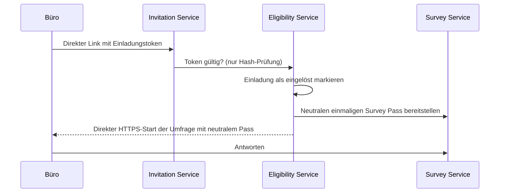

# Invitation Data Flow

Stand: 13. August 2026
Status: verbindliches Zielmodell vor Produktivversand

## Datenminimierung

Der Invitation Service besitzt eine eigene Datenbank. Sie enthält weder Umfrageantworten noch
Reportdaten oder politische Einordnungen. Die Kontakte stammen nur aus rechtmäßig verwendeten,
offiziellen Mandatsquellen. Jeder Import erhält einen Quellensnapshot.

```text
InvitationRecipient
- recipient_id (UUID)
- official_email
- display_name
- salutation
- constituency_reference (optional)
- invitation_status
- suppression_status
- created_at
- updated_at

RecipientSourceSnapshot
- source
- retrieved_at
- checksum
- import_version

Invitation
- invitation_id (UUID)
- recipient_id
- token_hash
- token_expires_at
- redeemed_at (nullable)
- reminder_count
- sent_at (nullable)
- status

Suppression
- recipient_id
- reason: no_reminders | hard_bounce | objection | invalid_address
- created_at
```

Der Roh-Token wird nur bei der Erzeugung und im direkten Versandlink verarbeitet. Gespeichert wird
ein Hash eines kryptografisch zufälligen Tokens mit mindestens 256 Bit Entropie. E-Mail-Adresse,
Betreff und Anzeigename werden vor Versand gegen Header-Injection validiert.

## Einlösung und Survey-Pass



Der ursprüngliche Einladungstoken ist nicht die Survey-ID. Der Survey Service erhält weder E-Mail
noch Name, Anrede, Wahlkreis oder CRM-ID. Er speichert nur einen neutralen Pass für die
Zugangskontrolle; Antworten werden anonymisiert konfiguriert. Eine Datenbankberechtigung oder
API, die `SurveyResponse` mit `InvitationRecipient` joinen kann, existiert nicht.

Für LimeSurvey bedeutet das praktisch: Das Survey-Teilnehmendenregister wird nur mit neutralen,
zufälligen Pässen ohne Name und E-Mail befüllt. Der Invitation Service kennt nur „eingelöst“ und
nicht „Antwort abgeschlossen“ oder den Inhalt einer Antwort.

## Reminder und Unterdrückung

Eine Erinnerung ist nur zulässig, wenn der Invitation Service für diese Einladung feststellt:

```text
status = SENT
redeemed_at IS NULL
suppression_status IS NULL
hard_bounce = false
reminder_count < REMINDER_LIMIT
```

„Eingelöst“ bedeutet nur, dass der Zugang genutzt wurde. Es ist kein Nachweis einer bestimmten
Antwort oder eines Reportabrufs. Ein Link „Keine weiteren Erinnerungen zu dieser Befragung“ setzt
eine Suppression im Invitation Service. Die Umfrage bleibt davon logisch getrennt.

## Versandzustände

```text
PENDING → SCHEDULED → SENT
                     ↘ DELIVERED_IF_SUPPORTED
                     ↘ SOFT_BOUNCE → retry (höchstens zwei Mal) → FAILED
                     ↘ HARD_BOUNCE → SUPPRESSED
PENDING | SCHEDULED → CANCELLED
```

`DELIVERED_IF_SUPPORTED` ist ausschließlich ein Transportstatus des Mailproviders. Er heißt nie
„gelesen“. Es werden keine Öffnungen oder Klicks gespeichert.

## Reportzustellung auf freiwillige Anfrage

Die freiwillige Zustellung eines Reports erzeugt einen eigenständigen, befristeten Datensatz:

```text
ReportDeliveryRequest
- temporary_report_reference
- delivery_email
- created_at
- expires_at
```

Die Adresse wird nicht mit Einladung oder Survey-Pass verknüpft. Nach Zustellung werden der
temporäre Report und der Request innerhalb der festgelegten kurzen Frist gelöscht. Bevorzugt wird
ein nicht erratbarer, kurz gültiger Download-Link ohne Personenbezug in der URL.
